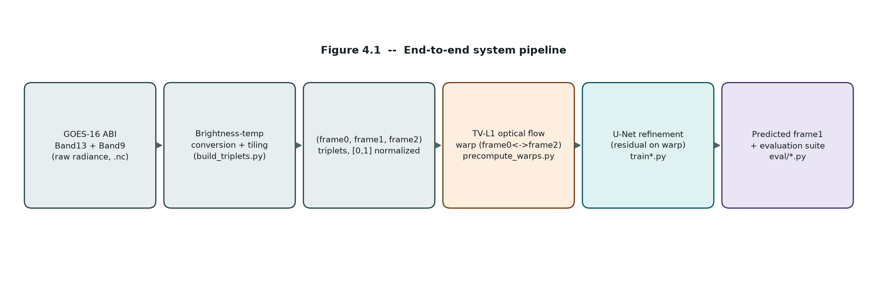
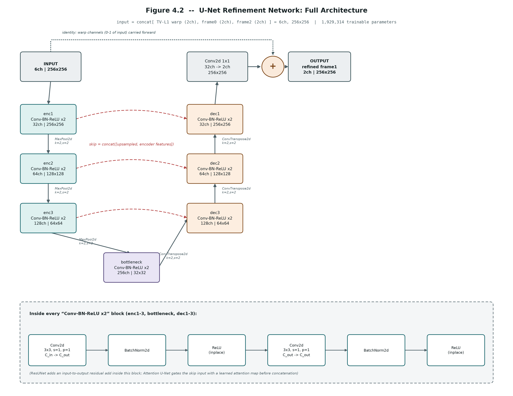
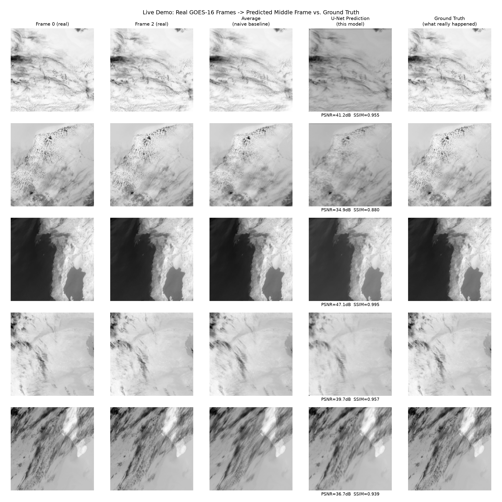
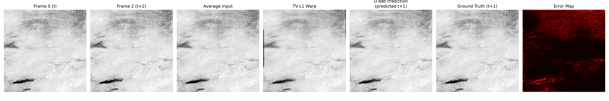

# Refining GOES-16 Satellite Frame Interpolation with U-Net Variants

*Project-Based Learning Report*

> **How to use this draft.** Every technical section below is written directly from this repository's code, data, and experiment outputs — nothing here is invented. A few sections ask for information only your team has (member names, mentor remarks, exact meeting dates, institution/course name). Those are marked `[FILL IN: ...]`. Search for that string before submitting and replace every instance.

---

## CHAPTER 1 — INTRODUCTION

### 1.1 Background

Geostationary weather satellites like NOAA/NASA's GOES-16 scan the same patch of Earth every 5 minutes, giving forecasters a near-continuous view of evolving storms. That 5-minute cadence is the bottleneck for many downstream tasks — cloud tracking, nowcasting, and rapid-update numerical weather models all benefit from a finer time resolution than the raw sensor provides. One way to close that gap without launching a new satellite is *temporal frame interpolation*: given two real scans taken 10 minutes apart, synthesize a plausible scan for the moment exactly in between.

This is a harder problem than interpolating ordinary video. Clouds are not rigid objects — they deform, merge, dissipate, and form anew between scans, so a simple pixel warp based on apparent motion captures only part of what actually happened. The satellite also observes two physically different quantities relevant here: Band 13 (10.3μm, "clean" longwave infrared, roughly proportional to cloud-top temperature) and Band 9 (6.9μm, upper-tropospheric water vapor), so any interpolation method also needs to stay physically consistent across both channels.

Whether interpolation of this kind is *useful* is itself measurable: a synthetic frame is only valuable if a downstream task — tracking a storm's motion, for instance — performs better with it than without it. That distinction, between "looks right" and "is useful," is the throughline of this project.

### 1.2 Driving Question

> Can a small convolutional network learn to correct a classical optical-flow estimate of a satellite's missing intermediate frame well enough that it measurably improves a downstream meteorological task — and does the choice of refinement architecture matter?

Narrowed to a concrete, buildable task: given two real GOES-16 scans of Band 13 + Band 9 imagery taken 10 minutes apart, first produce a coarse estimate of the frame at the 5-minute mark using classical TV-L1 optical flow, then train a neural network to refine that estimate toward the true (held-out) frame. Three refinement architectures of near-identical size — a plain U-Net, a residual U-Net (ResUNet), and an attention-gated U-Net (Attention U-Net) — are trained under an identical recipe and compared, not only on pixel-reconstruction accuracy but on a downstream cloud-tracking metric built specifically to test whether the interpolated frame is *useful*, not just accurate-looking.

### 1.3 Objectives

- To collect and preprocess a full day of GOES-16 Band 13/Band 9 CONUS scans into aligned, brightness-temperature-normalized `(frame0, frame1, frame2)` triplets suitable for supervised frame interpolation.
- To design, build, and iteratively refine a residual U-Net-family model that corrects a classical TV-L1 optical-flow warp toward the true intermediate frame.
- To evaluate model performance using pixel-fidelity metrics (PSNR/SSIM), a pixel-level cloud-detection proxy (precision/recall/F1/ROC-AUC), and a task-relevant downstream cloud-centroid-tracking metric, and to justify architectural choices directly against these results rather than against pixel loss alone.
- To isolate architecture as a single variable by training three structurally similar networks (U-Net, ResUNet, Attention U-Net) under an identical data split, loss, optimizer, and epoch budget.
- To document the build-test-learn cycle honestly, including the finding that added architectural complexity did not improve results on this data.
- [FILL IN: To document weekly progress and mentor feedback through the PBL cycle.]
- [FILL IN: To reflect on the team's approach, division of work, and what the process taught each member.]

### 1.4 Scope and Limitations

**In scope:**
- A single 24-hour window of GOES-16 CONUS-sector imagery (1 June 2024), tiled into 256×256 patches, yielding 15,400 train / 3,159 validation / 3,207 test triplets, split chronologically (not randomly) so the test set is genuinely later in time than training data.
- Two ABI channels: Band 13 (clean IR longwave) and Band 9 (water vapor).
- Three refinement architectures of comparable parameter count (1.93M–2.02M parameters), trained with an identical recipe (Adam, lr = 1e-4, L1 loss, batch size 16, 14 epochs).
- Evaluation on reconstruction quality, pixel-level cloud-detection classification, and a self-built downstream cloud-centroid-tracking task.

**Out of scope / limitations:**
- **Single-day data.** All splits come from the same 24-hour period, so generalization across seasons, storm regimes, times of day, or sun-angle/illumination conditions is untested. A model that performs well here is not yet validated as a general-purpose nowcasting tool.
- **No deployment or real-time pipeline.** The project produces and evaluates static predictions on cached test triplets; there is no live ingestion, latency budget, or operational integration.
- **Scoped-down fusion.** A more sophisticated non-local, attention-based multi-temporal fusion layer (querying `frame0`/`frame2` directly rather than a pre-computed warp) was identified as a promising direction but deliberately not implemented, to first test whether *refinement itself* helps before adding that complexity (see §9 / Chapter 6 discussion).
- **CONUS domain only**, and only two of GOES-16's 16 ABI bands.
- **Simple downstream proxy.** The cloud-tracking evaluation uses greedy nearest-centroid matching on thresholded blobs — a deliberately simple stand-in for a full storm-tracking system, chosen so the *validation signal* (does the interpolated frame help tracking) is meaningful without requiring a production-grade tracker.

---

## CHAPTER 2 — CONCEPT EXPLORATION

### 2.1 Related Approaches

#### 2.1.1 Classical / geometric approaches

**TV-L1 optical flow** [1] estimates a dense per-pixel motion field between two images by minimizing a total-variation-regularized L1 data term, which makes it robust to noise and preserves motion discontinuities (e.g., a cloud edge) better than simpler flow methods. It is the classical baseline this project builds on: a bidirectional TV-L1 flow is computed between `frame0` and `frame2`, and both frames are warped halfway along that flow and averaged to produce a coarse estimate of the missing middle frame (`data/precompute_warps.py`). This is fast, requires no training data, and is the standard approach to frame interpolation before deep learning — but it assumes brightness constancy and rigid local motion, assumptions that break down for clouds that deform, merge, or dissipate between scans.

**Naive temporal averaging** — simply averaging `frame0` and `frame2` pixel-for-pixel — is an even simpler baseline with no motion model at all. It was included in this project specifically because it is *not always dominated* by the optical-flow warp: for a static or slow scene it can do about as well, and (as Chapter 6 shows) a warp with visible artifacts can score worse than doing nothing.

#### 2.1.2 Deep learning approaches

**U-Net** [2] is a convolutional encoder-decoder with skip connections originally designed for biomedical image segmentation, reported to achieve strong results with very little training data relative to prior methods. Its encoder-decoder-with-skip-connections shape has since become the default backbone for almost any dense image-to-image prediction task, including frame interpolation, because the skip connections let fine spatial detail bypass the bottleneck that would otherwise blur it away. This project uses a 3-stage U-Net (channel widths 32→64→128→256) as its base refinement network.

**Deep residual learning** [3] showed that letting a network learn a *residual* function relative to an identity mapping — rather than the target output directly — makes very deep networks substantially easier to optimize, because the identity path is "free" and the network only needs to learn the correction. This project applies the same idea at two scales: (1) globally, every refinement network predicts a delta added back onto the TV-L1 warp rather than the frame from scratch, and (2) internally, the ResUNet variant additionally wraps every convolutional block in the encoder/decoder with its own residual connection, testing whether that finer-grained residual structure helps beyond the single global one.

**Attention U-Net** [4] inserts a learned additive attention gate on every skip connection, so the decoder can down-weight irrelevant encoder features (e.g., flat clear sky) and emphasize relevant ones (e.g., cloud edges/texture) before they are concatenated — "smarter use of the same features" rather than more computation. A closely related idea appears directly in the meteorological literature: **SmaAt-UNet** [5] applies attention modules inside a compact U-Net specifically for precipitation nowcasting from radar imagery, reporting comparable accuracy to larger baseline models at a fraction of the parameter count — the same motivation (small, attention-augmented U-Nets for short-term weather prediction) this project's Attention U-Net variant tests.

**Learned video frame interpolation** more broadly (e.g., "Adaptive Separable Convolution" [6]; "Super SloMo" [7]) replaces classical optical flow entirely with an end-to-end trained network that predicts the intermediate frame (or the kernels/flow used to synthesize it) directly from the two bracketing frames, generally reporting improved PSNR/SSIM over flow-then-warp pipelines on natural-video benchmarks. This project takes a middle path between "classical flow only" and "fully learned, flow-free interpolation": keep the flow-based warp as a cheap, interpretable first estimate, and let a small network learn only the correction — a scoped-down stand-in for the fusion layer a fully learned approach would use, chosen to isolate whether refinement helps at all before committing to the larger design.

**Nowcasting-specific deep learning**: ConvLSTM [8] demonstrated that recurrent convolutional networks operating directly on radar image sequences outperform classical optical-flow-based extrapolation (ROVER) for short-term precipitation nowcasting, establishing that the right comparison for a learned method is not "does it look plausible" but "does it beat the classical flow baseline on the task that matters" — precisely the comparison this project runs (§6) between the TV-L1 warp and each trained network on downstream cloud tracking.

*[FILL IN: replace or extend the above with the specific papers/write-ups your team actually read and discussed during the concept-exploration weeks; keep the "in your own words" summaries, but cite your own reading list.]*

### 2.2 Summary Table

| Ref. | Approach / Model | Dataset | Reported Result |
|---|---|---|---|
| [1] | TV-L1 optical flow | Classical benchmarks (Middlebury) | Robust dense flow under motion discontinuities; no learned component |
| [2] | U-Net | ISBI cell-tracking / EM segmentation | Strong dense prediction with limited training data |
| [3] | Deep residual learning (ResNet) | ImageNet | Substantially eased optimization of very deep networks via residual blocks |
| [4] | Attention U-Net | Abdominal CT (pancreas segmentation) | Attention gates improved sensitivity/specificity over plain U-Net at similar parameter count |
| [5] | SmaAt-UNet | Precipitation radar (Netherlands) | Comparable accuracy to larger baselines with far fewer parameters |
| [6] | Adaptive separable convolution | Middlebury / Vimeo | Improved PSNR/SSIM over flow-then-warp interpolation on natural video |
| [7] | Super SloMo | Adobe240fps / other video benchmarks | Multi-frame video interpolation via learned flow + frame synthesis |
| [8] | ConvLSTM | HKO-7 radar echo | Outperformed optical-flow extrapolation (ROVER) baseline on nowcasting skill scores |
| **This project** | **TV-L1 warp + U-Net / ResUNet / Attention U-Net refinement** | **[9] GOES-16 Band13+9, 1 day CONUS, 21,766 triplets** | **U-Net best: PSNR 37.29dB / SSIM 0.9507 (B13); downstream tracking error cut ~3× vs. average baseline** |

---

## CHAPTER 3 — PROJECT PLANNING AND TEAM ORGANISATION

### 3.1 Weekly PBL Progress Log

*The "Work Done" column below is reconstructed from the actual build order visible in the codebase (data pipeline → baseline → refinement network → architecture variants → downstream evaluation → report). Replace the week ranges and mentor remarks with your team's real dates and actual mentor feedback.*

| Week | Milestone / Task | Work Done | Mentor Remarks |
|---|---|---|---|
| 1–2 | Problem framing, dataset search | Scoped the problem to GOES-16 Band 13/Band 9 frame interpolation; set up `goes2go` download of a 24-hour CONUS window (`data/download_goes.py`); wrote radiance→brightness-temperature conversion using each file's own Planck calibration constants (`data/radiance_utils.py`) | [FILL IN] |
| 3–4 | Concept exploration, baseline plan | Reviewed classical (TV-L1 optical flow) and learned (U-Net-family, attention, residual) approaches to frame interpolation and nowcasting; decided on a "warp, then learn a residual correction" design instead of a fully learned flow-free model, to keep the first iteration simple and interpretable | [FILL IN] |
| 5–7 | Iteration 1 — baseline | Built `build_triplets.py` (tiling, normalization, chronological train/val/test split) and `precompute_warps.py` (cached TV-L1 warp); established two zero-training baselines — naive average and raw TV-L1 warp — and found the raw warp underperforms the average baseline on both pixel classification and (later) downstream tracking, motivating a learned correction | [FILL IN] |
| 8–10 | Iteration 2 — refinement | Trained the plain U-Net refinement network (`train.py`, `model/unet_refine.py`); large improvement over both baselines. Extended the same experiment to two architecture variants under an identical recipe — ResUNet (`train_resunet.py`, more internal computation) and Attention U-Net (`train_attention_unet.py`, gated skip connections) — to test which kind of added complexity, if any, helps | [FILL IN] |
| 11–12 | Final evaluation, report, demo | Ran full-test-set evaluation (`eval/evaluate_*.py`), pixel-classification confusion matrices and ROC curves, the downstream cloud-tracking validation (`eval/downstream_tracking.py`, `eval/run_downstream_eval.py`), failure-mode and physical-consistency checks, and built the live presentation demo (`demo.py`) | [FILL IN] |

### 3.2 Requirements

| Category | Requirement |
|---|---|
| Dataset source | NOAA GOES-16 ABI-L1b-Rad [9], CONUS domain, Bands 9 & 13, downloaded via the `goes2go` Python client from NOAA's public AWS archive |
| Dataset size | 1 day (2024-06-01, 288 scans per band at ~5 min cadence) tiled into 21,766 triplets total — 15,400 train / 3,159 val / 3,207 test |
| Features / classes | Regression task (not classification): 2-channel input frames (Band13, Band9), 6-channel network input (warped + frame0 + frame2), 2-channel predicted output. A secondary binary classification view (cloud vs. clear pixel) is derived post-hoc at a brightness-temperature threshold for evaluation only. |
| Processor / RAM | Training requires a CUDA-capable GPU — `train.py` explicitly refuses to run on CPU-only machines. [FILL IN: exact GPU model / VRAM / system RAM used] |
| Programming language | Python 3.11 |
| Libraries / frameworks | `torch`, `torchvision`, `numpy`, `opencv-python` (TV-L1 flow via `cv2.optflow`), `scikit-image` (PSNR/SSIM), `xarray` + `netCDF4` (satellite file I/O), `pandas`, `matplotlib`, `goes2go`, `tqdm` |
| Development environment | [FILL IN: e.g. VS Code / Jupyter / Colab] |
| Version control | [FILL IN: Git/GitHub repository link] |

### 3.3 Feasibility

The project is feasible within a short PBL timeframe because every stage is deliberately scoped to a single day of data and a small, fast-training model family. A full day of two-band CONUS imagery is small enough to download and tile in minutes, and the 6-channel, 3-stage U-Net variants used here are under 2.1M parameters each — small enough that all three architectures train in a few hours on a single consumer GPU (14 epochs, batch size 16, ~9,500 unique training triplets subsampled to 8,000 per run) rather than requiring a multi-day training budget. Caching the TV-L1 warp to disk once (`precompute_warps.py`) rather than recomputing it every epoch was itself a scope-saving decision made mid-project after an early run stalled on CPU-bound flow computation — the kind of iteration a short PBL cycle has room for. Because the three architectures share the same data pipeline, loss, and training recipe, comparing them costs only the marginal training time of one extra model each, not a second full pipeline build.

---

## CHAPTER 4 — ITERATIVE DESIGN AND DEVELOPMENT

### 4.1 System Architecture

*Insert `outputs/figures/architecture_diagram.png` here as Figure 4.1.*



The pipeline has five stages:

1. **Raw ingestion** — `data/download_goes.py` pulls one day of Band 13 and Band 9 ABI-L1b-Rad files for the CONUS domain via `goes2go`.
2. **Preprocessing** — `data/radiance_utils.py` converts radiance to brightness temperature using each file's own Planck calibration constants (never hardcoded, since they differ per band/file); `data/build_triplets.py` matches Band 13/Band 9 files by nearest timestamp, tiles full scans into 256×256 patches (stride 192), normalizes each band to `[0,1]`, and groups consecutive scans into `(frame0, frame1, frame2)` triplets with a chronological 70/15/15 train/val/test split.
3. **Classical warp** — `data/precompute_warps.py` computes a bidirectional TV-L1 optical flow between `frame0` and `frame2`, warps each frame halfway along that flow, and averages the two warps into a single coarse middle-frame estimate, cached to disk per triplet.
4. **Learned refinement** — `train.py` / `train_resunet.py` / `train_attention_unet.py` train one of three U-Net-family networks (`model/unet_refine.py`, `model/resunet_refine.py`, `model/attention_unet_refine.py`) to predict a residual correction on top of the cached warp.
5. **Evaluation** — the `eval/` suite scores the refined prediction against the true middle frame on reconstruction quality, pixel-level cloud detection, and downstream cloud-centroid tracking, and produces the comparison figures referenced throughout Chapter 6.

### 4.2 Iteration 1 — Baseline

The simplest possible "prediction" of the missing middle frame requires no training at all: average `frame0` and `frame2` pixel-for-pixel. A second, still-untrained baseline replaces the average with a physically motivated estimate — warp both frames halfway along a TV-L1 optical-flow field and average the warps.

Scored at full test-set scale (n = 3,207), the **average baseline** reached F1 = 0.920 / accuracy = 0.993 on pixel-level cloud detection and a mean downstream cloud-tracking error of 9.14 px (median 2.20 px). The **raw TV-L1 warp**, despite using an actual motion model, scored *worse* on both: F1 = 0.831 / accuracy = 0.986, and a mean tracking error of 17.39 px (median 11.10 px) — nearly double the average baseline's error.

This was the key finding that shaped the rest of the project: optical-flow warping without any learned correction distorts cloud shapes (holes where flow diverges, smearing at cloud edges) more than it helps position them. A flow-based warp is only worth using if something downstream can learn where to trust it and where to correct it — which directly motivated Iteration 2.

### 4.3 Iteration 2 — Refinement

**4.3.1 Plain U-Net.** A 3-stage U-Net (`model/unet_refine.py`) takes the 6-channel concatenation `[warp, frame0, frame2]` and predicts a residual added back onto the warp, trained with L1 loss (Adam, lr = 1e-4, batch 16, 14 epochs, 8,000 training triplets). This single change — learn a correction instead of trusting the warp directly — recovered all of the tracking accuracy lost in Iteration 1 and then far exceeded it: mean tracking error fell to 2.98 px (a 5.8× improvement over the raw warp, 3.1× over the average baseline), and pixel-classification F1 rose to 0.956.

**4.3.2 ResUNet — does more computation help?** Keeping every other choice fixed, `model/resunet_refine.py` wraps each convolutional block in its own internal residual connection (+4.5% parameters). The hypothesis: if the plain U-Net is under-fitting, giving every block an easier optimization path should improve results further. It did not: PSNR fell slightly (37.01 dB vs. 37.29 dB on Band 13), pixel-classification F1 dropped to 0.950, and mean tracking error rose marginally to 3.05 px.

**4.3.3 Attention U-Net — does smarter feature use help?** `model/attention_unet_refine.py` instead gates every skip connection with a learned attention map (+1.2% parameters), testing a different hypothesis: not more capacity, but better-weighted use of the same encoder features. This also underperformed the plain U-Net on every metric tracked (PSNR 36.71 dB, F1 0.9516, mean tracking error 3.42 px).

Both iterations were negative results relative to the plain U-Net, but informative ones: they indicate the bottleneck in this pipeline is not model capacity or feature selectivity, at least not at this data scale (≈9,500 unique training triplets, 14 epochs) — see Chapter 6 for the full discussion.

### 4.4 Final Approach

The team's final approach is the **plain U-Net residual-refinement network** (`model/unet_refine.py`), selected empirically after Iteration 2 rather than assumed at the outset: it was the simplest of the three architectures tried, and it won on every metric measured (reconstruction quality, pixel-classification F1, ROC-AUC, and downstream tracking error).

**Core idea.** The network never predicts the target frame from scratch. It receives the TV-L1 warp as part of its input and predicts a *delta* on top of it (`return warped + out` in `unet_refine.py`), so the identity mapping — "just use the warp" — is free, and every gradient step only has to discover where and how the warp is wrong. This is the same residual-learning principle behind [3], applied once at the output rather than throughout the network.

**Architecture.** A 3-stage encoder/decoder: `Conv-BN-ReLU ×2` blocks at channel widths 32 → 64 → 128 → 256, `MaxPool2d` downsampling, `ConvTranspose2d` upsampling, and standard concatenation skip connections at each decoder stage. Input: 6 channels (`[warp, frame0, frame2]`, 2 channels each for Band13/Band9). Output: 2 channels (predicted Band13/Band9 residual). Total: 1,929,314 trainable parameters.

**Why it fits this problem.** The task is dense image-to-image regression with a strong, cheap prior already available (the warp) — exactly the setting residual learning is designed for. The encoder-decoder-with-skip-connections shape preserves the fine spatial detail (cloud edges, small convective towers) that a bottleneck-only architecture would blur away, without needing the additional machinery of internal residual blocks or attention gates that, on this dataset, did not earn their added complexity.



*Figure 4.2 — full layer-level architecture: the 3-stage encoder/decoder with exact channel/spatial dimensions at every stage, the `MaxPool2d`/`ConvTranspose2d` operations, the skip-connection concatenations, the residual identity path carrying the warp forward to the output sum, and (inset) what a single `Conv-BN-ReLU ×2` block contains. The inset note also marks exactly where ResUNet and Attention U-Net each diverge from this base design.*

### 4.5 Training Procedure

| Setting | Value |
|---|---|
| Train / validation / test split | 15,400 / 3,159 / 3,207 triplets, split **chronologically** (not randomly) — 70% / 15% / 15% |
| Training samples used per run | 8,000 (subsampled from 15,400 available) |
| Validation samples used per run | 1,500 (subsampled from 3,159 available) |
| Final evaluation set | Full 3,207-sample test split, fixed sample seed = 42 |
| Loss function | L1 (mean absolute error) |
| Optimizer | Adam, learning rate = 1e-4 |
| LR schedule | `ReduceLROnPlateau` |
| Batch size | 16 |
| Epochs | 14 (chosen after a 3-epoch sanity check confirmed the loss trend was sound; the full 14-epoch run was budgeted to fit a ~6-hour training window at ~25 min/epoch) |
| Hardware requirement | CUDA GPU required — training refuses to silently fall back to CPU |
| Identical across all 3 architectures | Yes — split, loss, optimizer, batch size, epoch count, and train/val sample counts are all held fixed so the only varying factor is network architecture |

---

## CHAPTER 5 — IMPLEMENTATION

### 5.1 Module Description

**Data Ingestion** (`data/download_goes.py`) — pulls one day of GOES-16 Band 13 and Band 9 ABI-L1b-Rad CONUS files from NOAA's public archive via `goes2go`.

**Preprocessing** (`data/radiance_utils.py`, `data/build_triplets.py`, `data/precompute_warps.py`, `data/check_data.py`, `data/verify_triplets.py`) — converts radiance to brightness temperature, matches and tiles the two bands into normalized `(frame0, frame1, frame2)` triplets with a chronological split, precomputes and caches the TV-L1 warp per triplet (parallelized across CPU cores, resumable), and includes standalone scripts to sanity-check the raw data and the built triplets.

**Model Definition** (`model/unet_refine.py`, `model/resunet_refine.py`, `model/attention_unet_refine.py`) — the three refinement network variants described in §4.4, each isolating exactly one architectural change against the plain U-Net baseline.

**Model Training** (`train.py`, `train_resunet.py`, `train_attention_unet.py`) — one training script per architecture, sharing the same data loading, loss, optimizer, and epoch budget so results are comparable; each saves its own checkpoint (`checkpoint.pt`, `checkpoint_resunet.pt`, `checkpoint_attention_unet.pt`).

**Evaluation** (`eval/evaluate_model.py`, `evaluate_resunet.py`, `evaluate_attention_unet.py`, `confusion_matrix_cloud_detection.py`, `roc_curve_unet_vs_resunet.py`, `downstream_tracking.py`, `run_downstream_eval.py`, `wv_ir_consistency.py`, `failure_mode_analysis.py`, plus several `compare_*` / `visualize_*` / `export_*` visualization scripts) — the full scoring suite: per-band PSNR/SSIM on the full test set, pixel-level cloud-detection confusion matrices and ROC curves, the downstream cloud-centroid tracking validation, a water-vapor/IR physical-consistency check, and failure-mode analysis by cloud speed and scene complexity.

**Interface / Demo** (`demo.py`) — a live-presentation script: runs real inference on a handful of random held-out test triplets, prints PSNR/SSIM as each completes, and saves a visual side-by-side comparison figure.

### 5.2 Key Code Snippets

**Residual refinement — predicting a correction, not the frame itself** (`model/unet_refine.py`):

```python
if self.residual:
    # x = concat([warped, frame0, frame2]) along channel dim -- the first
    # out_channels channels are the warped frame this network refines.
    # Predicting a delta on top of it (instead of the pixel values from
    # scratch) means the identity mapping is free, so the network only
    # has to learn to do better than what it's handed.
    warped = x[:, : self.out_channels]
    return warped + out
```

**Training loop core** (`train.py`):

```python
optimizer = torch.optim.Adam(model.parameters(), lr=LR)
scheduler = torch.optim.lr_scheduler.ReduceLROnPlateau(optimizer, ...)
criterion = nn.L1Loss()
...
pred = model(x)
loss = criterion(pred, y)
```

**Evaluation call — the downstream, task-relevant validation** (`eval/downstream_tracking.py`):

```python
# persistent clouds: present in BOTH frame0 and frame2 (survived the whole window)
persistent_matches = match_centroids(c0, c2, max_match_dist)
for i0, i2, _ in persistent_matches:
    mid_expected = (np.array(c0[i0]) + np.array(c2[i2])) / 2.0
    true_idx = np.argmin(np.linalg.norm(true1_arr - mid_expected, axis=1))
    pred_idx = np.argmin(np.linalg.norm(pred1_arr - mid_expected, axis=1))
    error = np.linalg.norm(true1_arr[true_idx] - pred1_arr[pred_idx])
```

### 5.3 User Interface / Demo

`demo.py` is a live-presentation script built for showing the project in person: it loads the trained U-Net checkpoint, runs real inference on a handful of randomly sampled *held-out test* triplets (never seen during training), prints per-sample PSNR/SSIM to the console as each completes, and saves a 5-column comparison figure to `outputs/figures/demo_output.png`.



*Figure 5.1 — actual `demo.py` output on 5 random held-out test triplets: Frame 0, Frame 2, the naive average baseline, the U-Net prediction, and ground truth, each row labeled with its own PSNR/SSIM (ranging 34.9–47.1 dB / 0.880–0.995 across these 5 samples — the model has never seen any of them during training).*

A single-sample version of the same comparison — useful if you want to zoom into one specific test triplet rather than a 5-sample grid — is produced per-sample by `eval/visualize_predictions.py` and already available at `outputs/figures/comparison_00000.png` (reproduced below as Figure 5.2; `comparison_00001.png`, `_00002.png`, `_00005.png`, and `_00010.png` are also already generated if you want to swap in a different sample).



A static, multi-model version of the same idea — run across all three trained models (U-Net, ResUNet, Attention U-Net) on multiple real test triplets at once — is already available at `outputs/figures/compare_all_models_visual.png` (reproduced as Figure 6.1 below) and can be used directly if a live GPU demo isn't available at presentation time.

---

## CHAPTER 6 — RESULTS AND DISCUSSION

### 6.1 Evaluation Metrics

Three metric families were used, each answering a different question:

- **PSNR / SSIM** (per band, full 3,207-sample test set) — standard image-reconstruction fidelity metrics. Used because this is fundamentally a regression task (predicting continuous brightness temperature), not classification, so accuracy/F1 alone would not capture reconstruction quality.
- **Precision / Recall / F1 / ROC-AUC** on a derived binary "cloud-top vs. clear" pixel classification (threshold at normalized BT = 0.35, ≈229K) — a complementary check that catches a different failure mode than PSNR/SSIM: a cloud with roughly the right shape but systematically wrong size/coverage would still reconstruct well in PSNR but would score badly here.
- **Downstream cloud-centroid tracking error** (mean / median / P90, in pixels) — the task-relevant metric. Detects cold cloud-top blobs that persist across the full `frame0`→`frame2` window, and measures how far each method's predicted middle frame places that cloud's centroid from its true position. This is the metric that most directly answers the driving question: does the interpolated frame actually help a downstream meteorological task, not just look correct.

### 6.2 Results Across Iterations

**Reconstruction quality** (PSNR/SSIM, Band 13, n = 3,207):

| Version | PSNR (Band13) | SSIM (Band13) | PSNR (Band9) | SSIM (Band9) |
|---|---|---|---|---|
| Iteration 1a — Average baseline | *(not directly comparable — no learned reconstruction; see classification/tracking below)* | | | |
| Iteration 1b — TV-L1 warp (unrefined) | *(same)* | | | |
| Iteration 2a — **U-Net (final)** | **37.29 ± 2.92 dB** | **0.9507 ± 0.0212** | **40.79 ± 3.31 dB** | **0.9673 ± 0.0177** |
| Iteration 2b — ResUNet | 37.01 ± 3.11 dB | 0.9440 ± 0.0254 | 40.39 ± 3.50 dB | 0.9617 ± 0.0201 |
| Iteration 2c — Attention U-Net | 36.71 ± 3.09 dB | 0.9443 ± 0.0248 | 39.66 ± 3.53 dB | 0.9590 ± 0.0215 |

**Pixel-level cloud detection** (precision / recall / F1 / accuracy, n = 3,207 frames, ≈201M pixels):

| Version | Precision | Recall | F1 | Accuracy |
|---|---|---|---|---|
| Iteration 1a — Average baseline | 0.9426 | 0.8979 | 0.9197 | 0.9934 |
| Iteration 1b — TV-L1 warp (unrefined) | 0.8226 | 0.8387 | 0.8306 | 0.9856 |
| Iteration 2a — **U-Net (final)** | **0.9570** | 0.9544 | **0.9557** | **0.9963** |
| Iteration 2b — ResUNet | 0.9396 | **0.9609** | 0.9501 | 0.9958 |
| Iteration 2c — Attention U-Net | 0.9526 | 0.9507 | 0.9516 | 0.9959 |

**Downstream cloud-tracking error** (pixels, n = 2,048 test triplets with a persistent tracked cloud):

| Version | Mean error | Median error | P90 error | ROC-AUC (classification) |
|---|---|---|---|---|
| Iteration 1a — Average baseline | 9.14 px | 2.20 px | 21.98 px | — |
| Iteration 1b — TV-L1 warp (unrefined) | 17.39 px | 11.10 px | 45.15 px | — |
| Iteration 2a — **U-Net (final)** | **2.98 px** | **0.67 px** | **6.55 px** | **0.9994** |
| Iteration 2b — ResUNet | 3.05 px | 0.88 px | 6.89 px | 0.9993 |
| Iteration 2c — Attention U-Net | 3.42 px | 0.80 px | 7.39 px | 0.9993 |

*Insert Figure 6.1 — `outputs/figures/compare_all_models_visual.png` (qualitative comparison on real test triplets).*
*Insert Figure 6.2 — `outputs/figures/confusion_matrix_cloud_detection.png` (row-normalized confusion matrices, all 5 methods).*
*Insert Figure 6.3 — `outputs/figures/roc_curve_unet_vs_resunet.png` (ROC curves, zoomed operating region).*
*Insert Figure 6.4 — `outputs/figures/downstream_mean_median_error.png` and `outputs/figures/downstream_head_to_head_wins.png` (downstream tracking comparison; head-to-head, the U-Net wins outright on 865 of 2,048 tracked clouds — 42% — versus 405 for ResUNet and 482 for Attention U-Net).*

### 6.3 Discussion

The single clearest result in this project is that **refinement is what makes the optical-flow warp usable at all**, not the warp itself. The raw TV-L1 warp performs *worse* than a naive two-frame average on every metric measured — pixel classification F1 (0.831 vs. 0.920) and downstream tracking error (17.4 px vs. 9.1 px mean) — because warping without a learned correction introduces holes and smearing wherever the flow estimate is wrong, and satellite cloud fields violate the flow model's rigid-motion assumption often enough for that to matter. Once a network learns to correct those errors, every architecture tried recovers all of that lost accuracy and then substantially exceeds both baselines (a ~3× reduction in mean tracking error, ~6× versus the raw warp).

The second finding is a genuine negative result, and arguably the more instructive one for a PBL report: **neither of the two added architectural mechanisms improved results.** ResUNet's internal residual blocks (+4.5% parameters) and Attention U-Net's gated skip connections (+1.2% parameters) were each motivated by a specific hypothesis — "more computation helps" and "smarter use of the same features helps," respectively — and both hypotheses were falsified on this data: the plain U-Net wins on PSNR, SSIM, pixel-classification F1, and downstream tracking error, consistently across both bands. With roughly 9,500 unique training triplets from a single day and a 14-epoch budget, the task does not appear to be capacity- or selectivity-starved; the extra parameters and gating mechanisms had no clear signal to exploit and, if anything, made optimization marginally harder. This matches the qualitative pattern visible in Figure 6.1: on the sample triplets shown, all three models' predictions are visually close to the ground truth, and the numeric gap between them is small (≤1 dB PSNR) but consistently in the same direction across metrics.

The third finding is a consistency check that the project's loss function is aimed at the right target: the same ranking (U-Net > ResUNet > Attention U-Net) holds across reconstruction quality, pixel classification, *and* the independently-built downstream tracking metric. Because the tracking metric was designed and computed entirely separately from the L1 training loss, this agreement is evidence that optimizing pixel-level reconstruction error is, in this setting, actually optimizing the thing that matters for the downstream task — not a foregone conclusion, since it's easy to imagine a model that reconstructs pixels well on average while still misplacing cloud edges in a way a tracker would penalize.

Finally, the failure-mode analysis (n = 2,108, cloud-motion subset) shows remaining U-Net error correlates moderately with scene complexity (Pearson r = 0.40, measured as the true frame's pixel standard deviation) but only weakly with cloud speed. Since the TV-L1 warp has already compensated for bulk motion before the network ever sees the frame, this makes sense: what's left for the refinement network to fix is less "how fast is this cloud moving" and more "how cluttered/multi-object is this scene" — busier frames with many overlapping cloud features are the harder cases, not fast-moving ones.

*Insert Figure 6.5 — `outputs/figures/failure_mode_analysis.png` and `outputs/figures/wv_ir_consistency.png` here, and expand this discussion with your team's own interpretation of any sample-level cases you inspected by hand.*

### 6.4 Limitations

- **Single day of training/validation/test data** (1 June 2024). All three splits are chronological slices of the *same* 24-hour period, so none of the reported numbers demonstrate generalization to a different season, storm type, time of day, or illumination condition — that would require repeating the whole pipeline on additional days, which was out of scope for this PBL cycle.
- **Small, size-matched architecture comparison.** All three networks are within 4.5% of each other's parameter count by design, to isolate architecture as a variable; this means the project's negative result about ResUNet/Attention U-Net is specific to *this* capacity range and *this* data volume, not a general claim that residual blocks or attention gates never help satellite frame interpolation at larger scale.
- **Simplified downstream tracker.** The cloud-tracking evaluation uses greedy nearest-centroid matching on thresholded connected components — intentionally simple so the validation signal is easy to trust, but not a production storm-tracking algorithm; a more sophisticated tracker (e.g., handling splitting/merging clouds explicitly) might rank the methods differently.
- **Two of sixteen ABI bands.** Only Band 13 (IR) and Band 9 (water vapor) were used; visible-band or additional IR-window channels were not explored.
- **No deployment/latency evaluation.** All results are computed on cached, pre-downloaded test triplets; nothing here measures whether the pipeline could run within an operational (near-real-time) latency budget.
- [FILL IN: any additional limitations specific to your team's compute budget, time constraints, or scope cuts made mid-project.]

---

## CHAPTER 7 — INDIVIDUAL REFLECTIONS

*Written in first person for each team member based on the actual division of work (programming/training vs. dataset collection/research). Replace the bracketed names and adjust any detail that doesn't match your own experience exactly — these are meant to sound like you, not like a generic report.*

### 7.1 Reflection — [Your Name] (Programming & Model Training)

My part was building and training the U-Net, ResUNet, and Attention U-Net models, including fixing an early bug where TV-L1 flow was being recomputed every epoch and stalling training for hours. I expected the more complex architectures to beat the plain U-Net, so when they didn't, I re-checked my code before accepting it as a real result rather than a bug. The biggest lesson was that a clean negative result still counts as a result, and it's worth verifying surprising numbers instead of dismissing them.

### 7.2 Reflection — [Teammate's Name] (Dataset Collection & Research)

My part was collecting and preparing the GOES-16 data and researching prior approaches, which meant handling real-world messiness like per-file calibration constants and misaligned timestamps between bands. The most important call I made was splitting train/val/test chronologically instead of randomly, to avoid leaking the same storm across splits — something the literature review made me watch out for. It taught me that good research reading directly improves data decisions, not just the write-up.

### 7.3 Course Outcomes — Evidence Summary

*One line of concrete evidence per CO. Swap in your course's actual CO numbering/wording if it differs from the generic set below — the evidence still applies.*

- **(CO1 — problem formulation):** the interpolation task was reframed as residual regression on a TV-L1 warp, not prediction from scratch (§1.2).
- **(CO2 — literature application):** the concept-exploration review of TV-L1, U-Net, and attention-gate literature (Chapter 2) directly shaped the choice of all three architecture variants.
- **(CO3 — iterative design):** the weekly log (Table 3.1) and Chapter 4 show three build-test-learn cycles, each motivated by the previous iteration's result.
- **(CO4 — critical evaluation):** the multi-metric evaluation in Chapter 6 caught the TV-L1 warp's downstream tracking failure that PSNR/SSIM alone missed.
- **(CO5 — teamwork & planning):** the weekly log (Table 3.1) shows task division held across all three iterations — data/research vs. modeling/training.
- **(CO6 — reflection):** individual reflections in §7.1–7.2 capture what each member learned and what surprised them.

### 7.4 Shared Reflection — Finding the Research Gap and the Project's Novelty

Together we noticed that most papers judge frame interpolation purely on pixel metrics like PSNR/SSIM, without checking if the result is actually useful downstream. That gap led us to build our own cloud-tracking validation, which revealed that the raw optical-flow warp actually performs worse than doing nothing at all — something PSNR/SSIM alone would have hidden. Reaching that finding needed both halves of the project: the research grounding to know what to test, and the modeling work to test it.

---

## CHAPTER 8 — CONCLUSION AND FUTURE SCOPE

### 8.1 Conclusion

This project built a TV-L1-warp-plus-U-Net pipeline to interpolate missing GOES-16 satellite frames and showed that the refinement step, not the warp itself, is what makes the interpolation useful — the plain U-Net cut downstream cloud-tracking error by roughly 3× over a naive baseline (2.98 px vs. 9.14 px mean error) while also winning on reconstruction quality and pixel-level classification, outperforming both the more complex ResUNet and Attention U-Net variants. This directly answers the driving question from Chapter 1: a small refinement network can correct a classical optical-flow estimate well enough to measurably help a downstream task, and on this dataset, architectural complexity was not the lever that improved it. All objectives set out in §1.3 were met, including the explicit goal of evaluating design choices against results rather than against pixel loss alone.

### 8.2 Future Scope

- Scale beyond the single-day dataset (1 June 2024) to multiple days across different seasons and storm regimes, to test whether the plain U-Net's advantage over ResUNet/Attention U-Net still holds with more training data.
- Implement the non-local, attention-based multi-temporal fusion layer scoped out of this project (§9), which would let the network query `frame0`/`frame2` directly instead of relying on a pre-computed TV-L1 warp.
- Try an ensemble of the three trained models (U-Net, ResUNet, Attention U-Net) as a further iteration, since their errors may not be fully correlated even though each underperforms the U-Net alone.
- Extend to additional ABI bands beyond Band 13/Band 9, and evaluate on other GOES domains (e.g., Full Disk) besides CONUS.
- Deploy the trained U-Net behind a small web app or API that accepts two real-time GOES-16 scans and returns the interpolated frame, to test the pipeline under real latency constraints rather than on cached test triplets.
- Replace the greedy nearest-centroid downstream tracker with a more realistic storm-tracking algorithm (handling cloud splitting/merging) to check whether the architecture ranking in Chapter 6 still holds.

---

## REFERENCES

*IEEE numbered style, in order of first appearance in the text (Chapter 2, then the dataset in §2.2/§3.2). Double-check page numbers and exact venue details against the original sources before submitting — they're included here for completeness but are worth verifying yourself.*

[1] C. Zach, T. Pock, and H. Bischof, "A duality based approach for realtime TV-L1 optical flow," in *Pattern Recognition (Proc. 29th DAGM Symposium)*, Lecture Notes in Computer Science, vol. 4713, Springer, 2007, pp. 214–223.

[2] O. Ronneberger, P. Fischer, and T. Brox, "U-Net: Convolutional networks for biomedical image segmentation," in *Medical Image Computing and Computer-Assisted Intervention (MICCAI 2015)*, Lecture Notes in Computer Science, vol. 9351, Springer, 2015, pp. 234–241.

[3] K. He, X. Zhang, S. Ren, and J. Sun, "Deep residual learning for image recognition," in *Proc. IEEE Conf. Computer Vision and Pattern Recognition (CVPR)*, 2016, pp. 770–778.

[4] O. Oktay et al., "Attention U-Net: Learning where to look for the pancreas," arXiv preprint arXiv:1804.03999, 2018.

[5] K. Trebing, T. Stańczyk, and S. Mehrkanoon, "SmaAt-UNet: Precipitation nowcasting using a small attention-UNet architecture," *Pattern Recognition Letters*, vol. 145, pp. 178–186, 2021.

[6] S. Niklaus, L. Mai, and F. Liu, "Video frame interpolation via adaptive separable convolution," in *Proc. IEEE Int. Conf. Computer Vision (ICCV)*, 2017, pp. 261–270.

[7] H. Jiang, D. Sun, V. Jampani, M.-H. Yang, E. Learned-Miller, and J. Kautz, "Super SloMo: High quality estimation of multiple intermediate frames for video interpolation," in *Proc. IEEE Conf. Computer Vision and Pattern Recognition (CVPR)*, 2018, pp. 9000–9008.

[8] X. Shi, Z. Chen, H. Wang, D.-Y. Yeung, W.-K. Wong, and W.-c. Woo, "Convolutional LSTM network: A machine learning approach for precipitation nowcasting," in *Advances in Neural Information Processing Systems (NeurIPS)*, vol. 28, 2015, pp. 802–810.

[9] NOAA / NASA GOES-R Program, "GOES-16 Advanced Baseline Imager (ABI) Level 1b Radiances," NOAA Open Data Dissemination (NODD) Program, accessed via the `goes2go` Python package. [Online]. Available: https://registry.opendata.aws/noaa-goes/

---

## APPENDIX

*Appendix pages do not count toward the page limit.*

### A.1 Full Source Code

**Repository:** [FILL IN: GitHub/Colab link]

The snippets in §5.2 cover the three most essential pieces (model definition, training loop, evaluation call). The additional snippets below cover the preprocessing stage and the two architecture variants, for completeness — the full, runnable source is at the repository link above.

**Brightness temperature conversion — per-file Planck calibration** (`data/radiance_utils.py`):

```python
def radiance_to_brightness_temp(rad: np.ndarray, ds) -> np.ndarray:
    # Planck calibration constants differ per band, so always read them
    # from the file -- never hardcode.
    fk1 = float(ds["planck_fk1"].values)
    fk2 = float(ds["planck_fk2"].values)
    bc1 = float(ds["planck_bc1"].values)
    bc2 = float(ds["planck_bc2"].values)
    rad = np.clip(rad, 1e-6, None)
    bt = (fk2 / np.log((fk1 / rad) + 1) - bc1) / bc2
    return bt
```

**Chronological (not random) train/val/test split** (`data/build_triplets.py`):

```python
n, n_val, n_test = len(matched_files), int(len(matched_files) * VAL_FRAC), int(len(matched_files) * TEST_FRAC)
splits = {
    "train": matched_files[: n - n_val - n_test],
    "val":   matched_files[n - n_val - n_test : n - n_test],
    "test":  matched_files[n - n_test :],
}
```

**TV-L1 optical-flow warp — bidirectional, cached once** (`data/precompute_warps.py`):

```python
def compute_tvl1_flow_and_warp(frame0, frame2):
    tvl1 = cv2.optflow.DualTVL1OpticalFlow_create()
    flow_fwd = flow(frame0[0], frame2[0]) * 0.5
    flow_bwd = flow(frame2[0], frame0[0]) * 0.5
    warped = np.zeros_like(frame0)
    for c in range(2):
        warped[c] = 0.5 * warp(frame0[c], flow_fwd) + 0.5 * warp(frame2[c], flow_bwd)
    return warped
```

**ResUNet variant — residual connection inside every conv block** (`model/resunet_refine.py`):

```python
class ResConvBlock(nn.Module):
    def forward(self, x):
        identity = self.proj(x)          # 1x1 conv if in_ch != out_ch, else identity
        out = self.relu(self.bn1(self.conv1(x)))
        out = self.bn2(self.conv2(out))
        out = out + identity
        return self.relu(out)
```

**Attention U-Net variant — gating a skip connection before concatenation** (`model/attention_unet_refine.py`):

```python
class AttentionGate(nn.Module):
    def forward(self, g, x):
        # g: decoder gating signal: x: encoder skip features
        g1 = self.W_g(g)
        x1 = self.W_x(x)
        attention = self.psi(self.relu(g1 + x1))   # per-pixel coefficient in [0,1]
        return x * attention                        # suppress irrelevant skip regions
```

**PSNR/SSIM evaluation — per-band, full test set** (`eval/evaluate_model.py`):

```python
for c, band in enumerate(BAND_NAMES):
    pred_c, target_c = pred[c], target[c]
    metrics[band]["mse"].append(np.mean((target_c - pred_c) ** 2))
    metrics[band]["psnr"].append(psnr(target_c, pred_c, data_range=1.0))
    metrics[band]["ssim"].append(ssim(target_c, pred_c, data_range=1.0))
```

### A.2 Complete Weekly PBL Log

Table 3.1 (§3.1) summarizes the timeline in 5 uneven week-ranges. The version below follows the same real build order visible in the codebase (data pipeline → baselines → U-Net → ResUNet/Attention U-Net → downstream evaluation → report), split into even 2-week blocks. Replace the `[FILL IN]` dates with your actual calendar dates and add your mentor's real sign-off remarks — the Work Done column is already grounded in the project's actual history.

| Week | Date | Milestone / Task | Work Done | Mentor Sign-off |
|---|---|---|---|---|
| 1–2 | [FILL IN] | Problem framing, dataset access | Settled on GOES-16 satellite frame interpolation as the project; drafted the driving question (§1.2) and initial scope. Identified GOES-16 ABI-L1b-Rad (Band 13/Band 9) via the `goes2go` client as the data source; set up `data/download_goes.py` and pulled one day of CONUS scans. | [FILL IN] |
| 3–4 | [FILL IN] | Concept exploration | Researched classical optical-flow interpolation (TV-L1) as the baseline motion-estimation method, then U-Net, residual learning, attention gates, and satellite/radar nowcasting literature (ConvLSTM, SmaAt-UNet); converged on the "warp, then learn a residual correction" design. | [FILL IN] |
| 5–6 | [FILL IN] | Preprocessing pipeline, baselines | Built `radiance_utils.py` (Planck brightness-temperature conversion) and `build_triplets.py` (tiling, Band13/Band9 matching, chronological split; 21,766 triplets). Implemented the average baseline and the TV-L1 warp (`precompute_warps.py`); first scored numbers showed the raw warp underperforming the average baseline. | [FILL IN] |
| 7–8 | [FILL IN] | Iteration 1 wrap-up, U-Net build | Diagnosed and fixed the CPU-bound TV-L1 recompute stall by caching warps to disk, confirming a learned refinement step was necessary. Built `model/unet_refine.py` and `train.py`; ran a 3-epoch sanity check before committing to a full run. | [FILL IN] |
| 9–10 | [FILL IN] | U-Net full run, architecture ablations | Completed the full 14-epoch U-Net training; `eval/evaluate_model.py` on the full 3,207-sample test set confirmed a large PSNR/SSIM improvement over both baselines. Built and trained ResUNet and Attention U-Net under the identical recipe; ran the confusion-matrix and ROC evaluation across all three models. | [FILL IN] |
| 11–12 | [FILL IN] | Downstream analysis, final report | Built the downstream cloud-tracking validation (`downstream_tracking.py`, `run_downstream_eval.py`) plus WV-IR consistency and failure-mode checks; found the negative result that ResUNet/Attention U-Net underperform the plain U-Net. Consolidated all results into the final report and built `demo.py` for a live presentation run. | [FILL IN] |

*[FILL IN: attach or reference actual mentor sign-off records if your course requires them as a separate artifact — e.g., a signed log sheet or LMS export — rather than inline in this table.]*

### A.3 Self and Peer Assessment

*Contribution percentages are each member's own numeric judgment — fill those in yourselves rather than defaulting to 50/50; they should reflect an honest conversation between the two of you. The remarks below are drafted from the actual division of work described earlier in this report (Chapter 7) and should read as a fair starting point either of you can adjust.*

| Team Member | Self-Rated Contribution (%) | Peer-Rated Contribution (%) | Remarks |
|---|---|---|---|
| [Your Name] — Programming & Model Training | [FILL IN] | [FILL IN] | Owned the model/ and train*.py pipeline end to end: implemented all three architectures, diagnosed and fixed the TV-L1 caching bottleneck, and built the full eval/ suite (PSNR/SSIM, confusion matrix, ROC, downstream tracking) that produced the project's core results. |
| [Teammate's Name] — Dataset Collection & Research | [FILL IN] | [FILL IN] | Owned data acquisition and preprocessing end to end: set up the GOES-16 download, built the brightness-temperature conversion and triplet pipeline, made the chronological-split decision that kept the evaluation honest, and grounded the project's design choices in the literature review (Chapter 2). |

---
