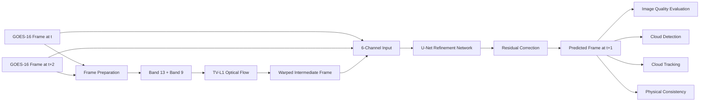
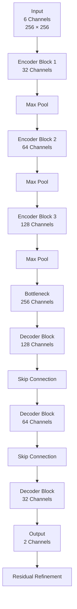
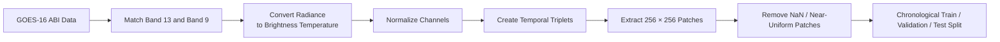
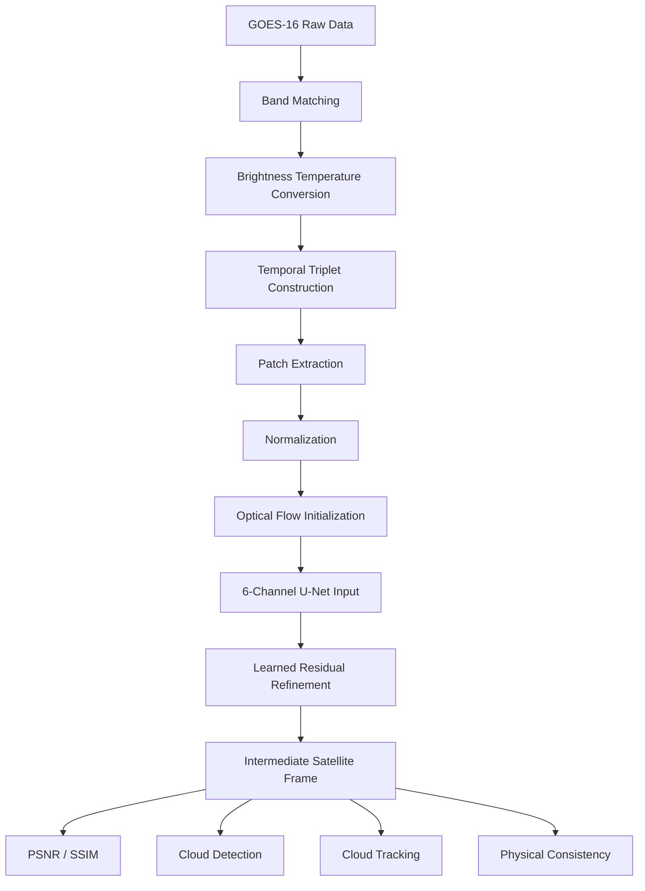

# Increasing Temporal Resolution of Geostationary Satellite

## Learning the Missing Moment Between Satellite Observations

A deep learning framework for generating intermediate geostationary satellite imagery from consecutive GOES-16 observations.

This project investigates whether machine learning can reconstruct the atmospheric state between two satellite observations, effectively increasing the temporal resolution of geostationary satellite data without requiring additional satellite scans.

---

## Overview

Geostationary satellites continuously observe the Earth, but satellite imagery is still available at discrete time intervals. Atmospheric systems such as clouds can evolve significantly between these observations.

This project addresses the problem of **temporal super-resolution**:

> Given two satellite observations at time (t) and (t+2), can we reconstruct the missing observation at (t+1)?

Instead of simply averaging the two available frames, the proposed approach combines:

* TV-L1 optical-flow-based warping
* Multi-channel GOES-16 satellite observations
* U-Net-based learned refinement
* Residual prediction
* Cloud detection evaluation
* Downstream cloud-motion tracking evaluation

The system is evaluated using GOES-16 ABI Band 13 and Band 9 observations.

---

## Problem Statement

Geostationary satellite observations provide frequent monitoring of weather systems, but the available temporal sampling can still leave gaps in rapidly evolving atmospheric phenomena.

Traditional interpolation methods may produce blurry or physically inconsistent intermediate frames.

This project explores a learned reconstruction pipeline that uses surrounding satellite observations to estimate the missing intermediate frame while preserving important cloud structures.

---

## Project Objective

The primary objective is to increase the effective temporal resolution of GOES-16 satellite imagery by reconstructing an intermediate observation between two consecutive frames.

The project evaluates whether the generated frames are useful not only at the image level, but also for downstream atmospheric analysis.

### The central question

**Can a learned model reconstruct a physically meaningful intermediate satellite frame better than conventional interpolation methods?**

---

# System Architecture



---

# Core Idea

The model does not attempt to generate the missing frame entirely from scratch.

Instead, the pipeline first estimates the intermediate position using optical flow and then allows a neural network to learn the remaining correction.

### Input

The U-Net receives six channels:

```text
Warped Intermediate Frame
        +
Frame at t
        +
Frame at t+2
```

Each satellite frame contains:

```text
Band 13
Band 9
```

Therefore:

```text
2 channels × 3 frames = 6 input channels
```

### Output

The network predicts:

```text
Band 13
Band 9
```

for the missing intermediate frame.

The final prediction uses residual refinement:

```text
Final Prediction
=
Warped Intermediate
+
Learned Residual
```

This allows the network to focus on correcting errors in the initial optical-flow estimate rather than learning the complete transformation from the beginning.

---

# U-Net Architecture



The implementation uses a compact U-Net with:

* 3 encoder stages
* 256-channel bottleneck
* Skip connections
* 3 decoder stages
* 2-channel output
* Residual refinement

---

# Dataset

The experiments use GOES-16 ABI Level-1b Radiance observations.

| Property            | Configuration                  |
| ------------------- | ------------------------------ |
| Satellite           | GOES-16                        |
| Instrument          | Advanced Baseline Imager (ABI) |
| Date                | 2024-06-01                     |
| Bands               | Band 13 and Band 9             |
| Data Source         | NOAA AWS / goes2go             |
| Patch Size          | 256 × 256                      |
| Patch Stride        | 192                            |
| Total Triplets      | 21,766                         |
| Training Triplets   | 15,400                         |
| Validation Triplets | 3,159                          |
| Test Triplets       | 3,207                          |

Each training example consists of three temporally consecutive observations:

```text
Frame t       Frame t+1       Frame t+2
   |              |               |
   |              |               |
   +--------------+---------------+
          Prediction Target
```

The middle frame is used as the ground-truth target during training.

---

# Data Preparation Pipeline



---

# Experimental Setup

The main U-Net model was trained using:

| Parameter               |             Value |
| ----------------------- | ----------------: |
| Training Samples Used   |             8,000 |
| Validation Samples Used |             1,500 |
| Test Samples            |             3,207 |
| Batch Size              |                16 |
| Epochs                  |                14 |
| Optimizer               |              Adam |
| Initial Learning Rate   |          1 × 10⁻⁴ |
| Loss Function           |           L1 Loss |
| LR Scheduler            | ReduceLROnPlateau |
| Input Channels          |                 6 |
| Output Channels         |                 2 |

Training requires a CUDA-enabled GPU.

---

# Models Compared

The project evaluates three learned architectures:

### U-Net

A compact encoder-decoder network with skip connections and residual refinement.

### ResUNet

A U-Net variant incorporating residual learning blocks.

### Attention U-Net

A U-Net variant incorporating attention mechanisms into the feature fusion process.

These models are compared against conventional interpolation approaches.

---

# Baselines

Two non-learned approaches are evaluated:

### Frame Averaging

The intermediate frame is estimated by averaging the two surrounding observations.

```text
Prediction = (Frame t + Frame t+2) / 2
```

### TV-L1 Optical Flow

Motion between the two surrounding frames is estimated using optical flow, followed by warping to approximate the intermediate state.

The learned models then build upon this motion-aware initialization.

---

# Results

## Image Reconstruction

### Band 13

| Model           |        PSNR (dB) |                SSIM |
| --------------- | ---------------: | ------------------: |
| U-Net           | **37.29 ± 2.92** | **0.9507 ± 0.0212** |
| ResUNet         |     37.01 ± 3.11 |     0.9440 ± 0.0254 |
| Attention U-Net |     36.71 ± 3.09 |     0.9443 ± 0.0248 |

### Band 9

| Model           |        PSNR (dB) |                SSIM |
| --------------- | ---------------: | ------------------: |
| U-Net           | **40.79 ± 3.31** | **0.9673 ± 0.0177** |
| ResUNet         |     40.39 ± 3.50 |     0.9617 ± 0.0201 |
| Attention U-Net |     39.66 ± 3.53 |     0.9590 ± 0.0215 |

The U-Net configuration achieved the highest reported PSNR and SSIM among the evaluated learned models.

---

# Cloud Detection Results

The reconstructed frames were also evaluated for cloud detection performance.

| Method          |  Precision |     Recall |   F1 Score |   Accuracy |
| --------------- | ---------: | ---------: | ---------: | ---------: |
| Frame Averaging |     0.9426 |     0.8979 |     0.9197 |     0.9934 |
| TV-L1           |     0.8226 |     0.8387 |     0.8306 |     0.9856 |
| U-Net           | **0.9570** | **0.9544** | **0.9557** | **0.9963** |
| ResUNet         |     0.9396 |     0.9609 |     0.9501 |     0.9958 |
| Attention U-Net |     0.9526 |     0.9507 |     0.9516 |     0.9959 |

---

# Downstream Cloud Tracking

Image quality alone does not determine whether a reconstructed satellite frame is useful.

Therefore, the project evaluates the reconstructed frames using cloud-motion tracking.

| Method          | Mean Error (px) | Median Error (px) | P90 Error (px) |
| --------------- | --------------: | ----------------: | -------------: |
| Frame Averaging |            9.14 |              2.20 |          21.98 |
| TV-L1           |           17.39 |             11.10 |          45.15 |
| U-Net           |        **2.98** |          **0.67** |       **6.55** |
| ResUNet         |            3.05 |              0.88 |           6.89 |
| Attention U-Net |            3.42 |              0.80 |           7.39 |

The downstream evaluation provides an additional test of whether the reconstructed imagery preserves information relevant to cloud motion.

---

# Results at a Glance

```text
U-Net Performance

Band 13 PSNR
37.29 dB

Band 13 SSIM
0.9507

Cloud Detection F1
0.9557

Mean Cloud Tracking Error
2.98 px
```

---

# Visual Results

Add the generated visual comparison from the repository here:

```markdown

```

For the multi-model comparison:

```markdown

```

These visualizations show the relationship between:

```text
Frame t
   ↓
Ground Truth t+1
   ↓
Frame t+2
   ↓
Baseline / Optical Flow
   ↓
Learned Reconstruction
```

---

# End-to-End Workflow



---

# Repository Structure

```text
Increasing_Temporal_Resolution_Of_Geostationary_Satellite/
│
├── data/
│   └── build_triplets.py
│
├── model/
│   └── unet_refine.py
│
├── eval/
│   └── evaluate_model.py
│
├── outputs/
│   └── figures/
│
├── demo.py
├── train.py
├── train_resunet.py
├── train_attention_unet.py
├── requirements.txt
└── README.md
```

---

# Installation

Clone the repository:

```bash
git clone https://github.com/SrimathiSubbiah/Increasing_Temporal_Resolution_Of_Geostationary_Satellite.git

cd Increasing_Temporal_Resolution_Of_Geostationary_Satellite
```

Install the required dependencies:

```bash
pip install -r requirements.txt
```

---

# Data Preparation

The data preparation pipeline is implemented in:

```text
data/build_triplets.py
```

The script:

1. Matches GOES-16 Band 13 and Band 9 observations.
2. Converts radiance values to brightness temperature.
3. Normalizes the satellite channels.
4. Constructs three-frame temporal sequences.
5. Extracts 256 × 256 patches.
6. Removes invalid and near-uniform patches.
7. Creates chronological train, validation, and test splits.

---

# Training

The main U-Net model can be trained using:

```bash
python train.py
```

The repository also contains training scripts for:

```bash
python train_resunet.py
```

and

```bash
python train_attention_unet.py
```

The training configuration uses the parameters described in the experimental setup above.

---

# Evaluation

The trained model can be evaluated using:

```bash
python eval/evaluate_model.py
```

The evaluation pipeline computes:

* MSE
* PSNR
* SSIM
* Cloud detection metrics
* Downstream cloud tracking performance
* Additional physical consistency measures

The test configuration evaluates 3,207 test triplets.

---

# Demo

Run the demonstration using:

```bash
python demo.py
```

The demo generates visual comparisons between the input observations, reconstructed intermediate frame, and reference frame.

---

# Why This Approach?

A simple interpolation method can estimate an intermediate frame numerically, but atmospheric structures are not necessarily linear in time.

The proposed pipeline therefore combines two ideas:

```text
Motion Estimation
       +
Learned Refinement
       =
Intermediate Satellite Reconstruction
```

Optical flow provides an initial estimate of where structures move.

The neural network then learns how to correct the remaining spatial and temporal differences.

This makes the reconstruction problem a **refinement problem rather than a complete image-generation problem**.

---

# Key Findings

The experiments show that:

* The learned U-Net reconstruction achieves 37.29 dB PSNR and 0.9507 SSIM on Band 13.
* Band 9 reconstruction reaches 40.79 dB PSNR and 0.9673 SSIM.
* The U-Net achieves a cloud detection F1 score of 0.9557.
* The U-Net achieves a mean downstream cloud-tracking error of 2.98 pixels.
* Learned refinement improves the evaluated downstream cloud-tracking performance compared with the tested non-learned baselines.
* The results demonstrate the potential of learned temporal interpolation for increasing the effective temporal resolution of geostationary satellite observations on the evaluated dataset.

---

# Limitations

The current study has several limitations:

* The experiments use observations from a single day.
* The dataset is based on GOES-16 observations.
* Only Band 13 and Band 9 are used.
* Training uses a limited subset of the available training samples.
* The current model is designed for 256 × 256 patches.
* Further validation across different weather systems, seasons, and geographic conditions is required.

These limitations should be considered when interpreting the reported results.

---

# Future Work

Potential extensions include:

* Training on longer multi-day or multi-season datasets.
* Incorporating additional GOES-16 spectral bands.
* Testing the approach on other geostationary satellites.
* Exploring transformer-based temporal architectures.
* Improving physical consistency constraints.
* Extending the model to uncertainty-aware prediction.
* Evaluating the approach on rapidly evolving severe-weather systems.
* Investigating real-time operational deployment.

---

# Technology Stack

| Category            | Technology                        |
| ------------------- | --------------------------------- |
| Programming         | Python                            |
| Deep Learning       | PyTorch                           |
| Satellite Data      | GOES-16 ABI                       |
| Data Access         | goes2go / NOAA AWS                |
| Image Processing    | OpenCV, scikit-image              |
| Numerical Computing | NumPy                             |
| Data Processing     | Pandas, Xarray                    |
| Visualization       | Matplotlib                        |
| Model               | U-Net / ResUNet / Attention U-Net |
| Motion Estimation   | TV-L1 Optical Flow                |

---

# Project Highlights

```text
GOES-16 Satellite Data
        ↓
Temporal Triplet Construction
        ↓
Optical Flow Initialization
        ↓
6-Channel U-Net
        ↓
Residual Refinement
        ↓
Intermediate Frame Reconstruction
        ↓
Image + Cloud + Tracking Evaluation
```

The project therefore evaluates the reconstruction at multiple levels:

```text
Pixel Level
    ↓
Image Quality
    ↓
Cloud Detection
    ↓
Cloud Motion Tracking
    ↓
Physical Consistency
```

---

# Research Contribution

The project focuses on more than producing visually plausible satellite images.

The reconstructed intermediate frames are evaluated for their usefulness in downstream atmospheric analysis.

The overall framework connects:

```text
Satellite Observation
        ↓
Temporal Reconstruction
        ↓
Image Quality
        ↓
Atmospheric Feature Detection
        ↓
Cloud Motion Analysis
```

This provides a broader evaluation of whether temporal super-resolution can improve the effective usability of geostationary satellite observations.

---

# Authors

**Srimathi Subbiah**
**Zohra Fakrudeen Ali**

Machine Learning Project
Geostationary Satellite Temporal Resolution Enhancement

---

# Summary

This project explores deep learning-based temporal interpolation for GOES-16 satellite imagery.

By combining optical-flow-based motion estimation with learned residual refinement, the system reconstructs an intermediate satellite observation between two known frames.

The approach is evaluated using image reconstruction metrics as well as downstream cloud detection and cloud tracking tasks.

The central idea is simple:

> **Instead of waiting for the next satellite observation, learn what happened between the observations.**

---

## Project Repository

```text
https://github.com/SrimathiSubbiah/Increasing_Temporal_Resolution_Of_Geostationary_Satellite
```

