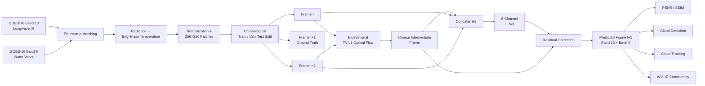
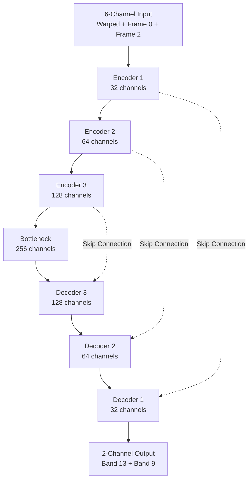
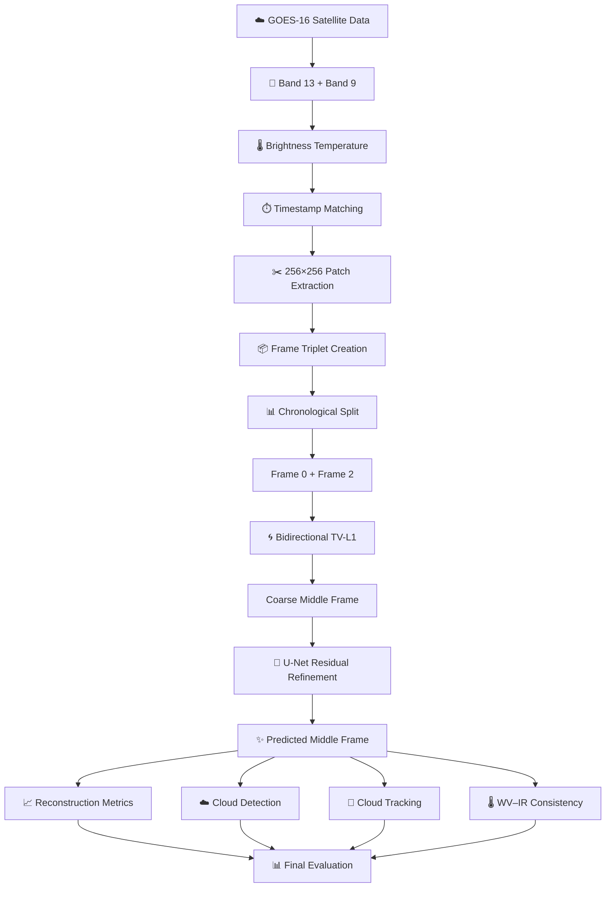
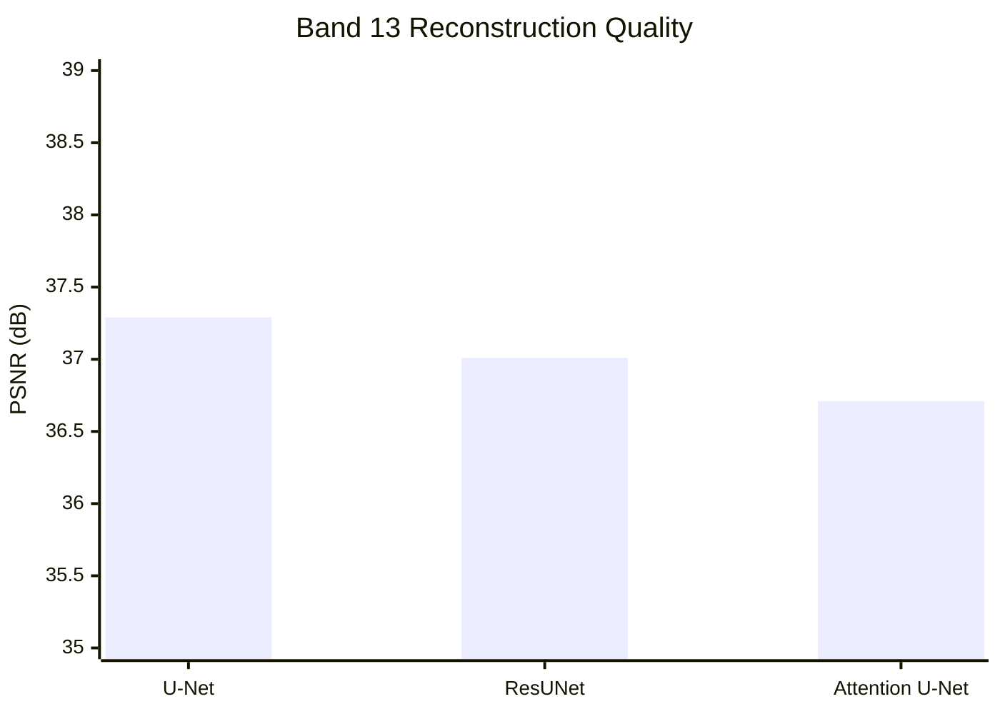
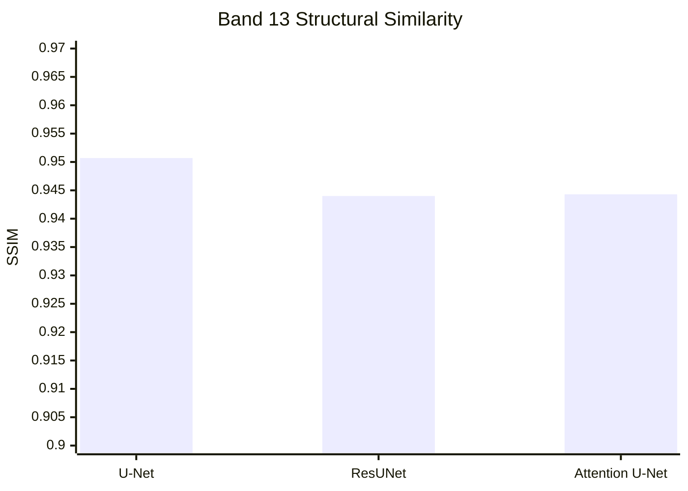
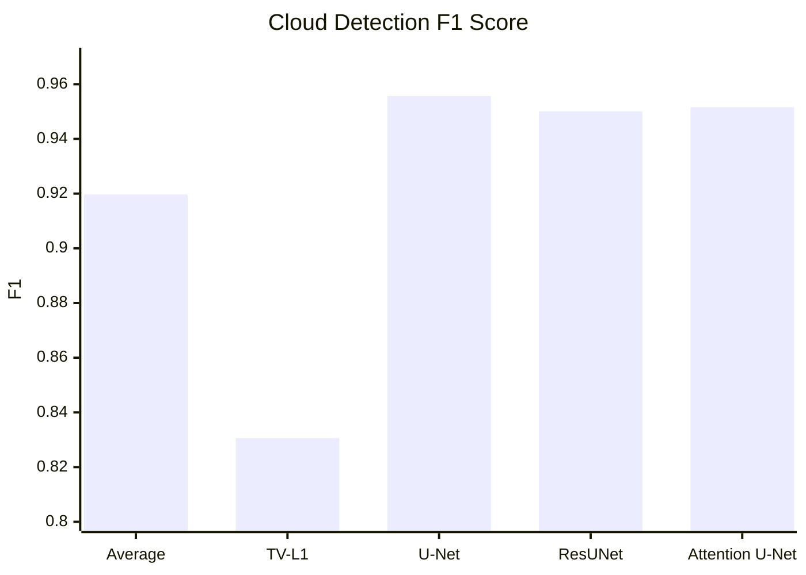
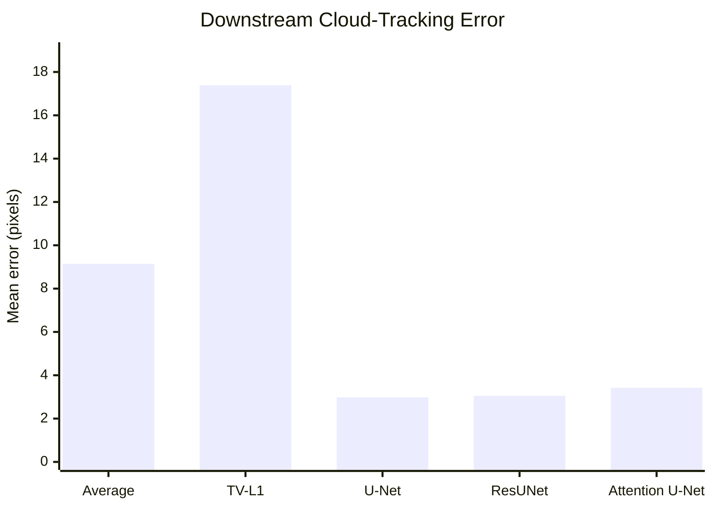
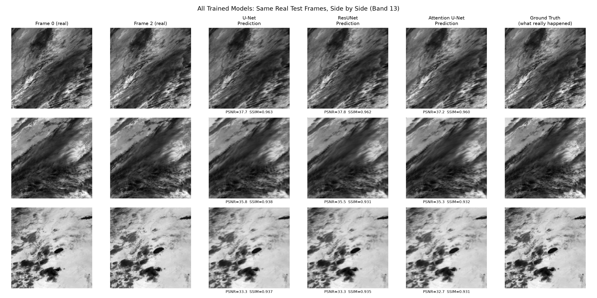

# 🛰️ Increasing Temporal Resolution of Geostationary Satellite Imagery

### **Learning the Missing Moment Between Satellite Observations**

> **Can machine learning reconstruct what a geostationary satellite would have seen between two real observations — and can that reconstructed frame actually improve a downstream meteorological task?**

This project investigates **temporal frame interpolation for GOES-16 satellite imagery** using a hybrid **optical-flow + deep-learning refinement pipeline**.

Instead of asking a neural network to generate an intermediate satellite image from scratch, the system first estimates the missing frame using **bidirectional TV-L1 optical flow**, then uses a compact **U-Net to learn and correct the remaining interpolation errors**.

The approach is evaluated not only using image-quality metrics such as **PSNR and SSIM**, but also through **cloud detection** and **downstream cloud-tracking accuracy**.

---

## ✨ Why This Project?

Geostationary satellites continuously observe the atmosphere, but observations are separated by several minutes.

For rapidly evolving phenomena such as:

* ☁️ Cloud motion
* 🌩️ Severe weather
* 🌀 Storm development
* 🌧️ Nowcasting
* 🌎 Atmospheric monitoring

even a few minutes of additional temporal information can be valuable.

The central idea of this project is simple:

```text
Real Satellite Frame
        │
        │       missing temporal information
        ▼
   ┌─────────┐
   │ Frame t │
   └─────────┘
        │
        │       ????
        │
   ┌─────────┐
   │ Frame t+2│
   └─────────┘
        │
        ▼
 ┌─────────────────┐
 │ Reconstructed   │
 │   Frame t+1     │
 └─────────────────┘
```

The goal is to make that **missing frame measurable, useful, and physically meaningful**.

---

# 🎯 Project Objective

Given two observed GOES-16 satellite frames:

**Frame 0 → Frame 2**

the system reconstructs the intermediate:

**Frame 1**

using:

> **TV-L1 Optical Flow → Coarse Interpolation → U-Net Residual Refinement**

The project compares three architectures under the same training setup:

| Model               | Purpose                                          |
| ------------------- | ------------------------------------------------ |
| **U-Net**           | Main residual-refinement model                   |
| **ResUNet**         | Tests whether residual blocks improve refinement |
| **Attention U-Net** | Tests whether attention improves refinement      |

Two non-learning baselines are also evaluated:

* **Naive temporal averaging**
* **Unrefined TV-L1 optical-flow warp**

---

# 🧠 Core Idea

The project does **not** generate the missing frame completely from scratch.

Instead:

```text
                  Classical Motion Estimation
                           │
Frame 0 ───────────────┐   │   ┌────────────── Frame 2
                       │   │   │
                       ▼   ▼   ▼
                  ┌─────────────────┐
                  │  Bidirectional  │
                  │    TV-L1 Flow   │
                  └────────┬────────┘
                           │
                           ▼
                    Coarse Middle Frame
                           │
                           │
              ┌────────────▼────────────┐
              │      U-Net Refinement   │
              │                         │
              │ Learn only the residual │
              │ correction              │
              └────────────┬────────────┘
                           │
                           ▼
                 Refined Intermediate
                      Satellite Frame
```

This makes the learning problem substantially more focused:

> **Estimate the error in the classical interpolation rather than relearning the entire image formation process.**

---

# 🏗️ System Architecture



---

# 🔬 Model Architecture

The final U-Net receives **6 channels**:

```text
TV-L1 warped frame   → 2 channels
Frame 0              → 2 channels
Frame 2              → 2 channels
                     ─────────────
                       6 channels
```

and predicts:

```text
Band 13 + Band 9
       ↓
   2 channels
```

### U-Net



The network learns a **residual correction** over the TV-L1 estimate:

```text
Prediction = TV-L1 Warp + Learned Residual
```

This allows the network to focus on:

* motion-estimation errors
* cloud boundaries
* deformation
* smearing
* holes introduced by optical flow
* complex multi-object cloud structures

---

# 🌎 Dataset

The project uses **GOES-16 ABI-L1b-Rad CONUS imagery**.

### Satellite Channels

| Band        | Role                    |
| ----------- | ----------------------- |
| **Band 13** | Clean Longwave Infrared |
| **Band 9**  | Water Vapor             |

Radiance values are converted into **brightness temperature** before model processing. The preprocessing pipeline then matches the two bands temporally, normalizes them, extracts patches, and forms consecutive frame triplets.

### Dataset Configuration

| Property       |         Value |
| -------------- | ------------: |
| Satellite      |       GOES-16 |
| Region         |         CONUS |
| Date           |    2024-06-01 |
| Bands          |        9 + 13 |
| Patch size     |     256 × 256 |
| Total triplets |    **21,766** |
| Training       |    **15,400** |
| Validation     |     **3,159** |
| Test           |     **3,207** |
| Split strategy | Chronological |

The repository implements the chronological split and 256×256 patch extraction directly in `data/build_triplets.py`.

---

# 🔄 End-to-End Workflow



---

# 📊 Results

The final evaluation uses the complete **3,207-triplet test set** for reconstruction metrics. The evaluation code samples across the full test split and computes per-band MSE, PSNR and SSIM.

## 🏆 Reconstruction Quality

### Band 13

| Model           |       PSNR ↑ |     SSIM ↑ |
| --------------- | -----------: | ---------: |
| U-Net           | **37.29 dB** | **0.9507** |
| ResUNet         |     37.01 dB |     0.9440 |
| Attention U-Net |     36.71 dB |     0.9443 |

### Band 9

| Model           |       PSNR ↑ |     SSIM ↑ |
| --------------- | -----------: | ---------: |
| U-Net           | **40.79 dB** | **0.9673** |
| ResUNet         |     40.39 dB |     0.9617 |
| Attention U-Net |     39.66 dB |     0.9590 |

---

## 📈 Band 13 PSNR Comparison



---

## 📈 Band 13 SSIM Comparison



---

# ☁️ Cloud Detection Performance

The interpolated frames are additionally evaluated as binary **cloud-top vs. clear** maps.

| Method           |  Precision |     Recall |         F1 |   Accuracy |
| ---------------- | ---------: | ---------: | ---------: | ---------: |
| Average baseline |     0.9426 |     0.8979 |     0.9197 |     0.9934 |
| TV-L1 warp       |     0.8226 |     0.8387 |     0.8306 |     0.9856 |
| **U-Net**        | **0.9570** | **0.9544** | **0.9557** | **0.9963** |
| ResUNet          |     0.9396 |     0.9609 |     0.9501 |     0.9958 |
| Attention U-Net  |     0.9526 |     0.9507 |     0.9516 |     0.9959 |

### F1 Comparison



---

# 🎯 Downstream Cloud Tracking

A key objective of the project is to determine whether interpolation is **actually useful**, rather than simply visually plausible.

Cloud-centroid tracking was evaluated on test triplets containing a persistent trackable cloud.

| Method           | Mean Error ↓ | Median Error ↓ | P90 Error ↓ |
| ---------------- | -----------: | -------------: | ----------: |
| Average baseline |      9.14 px |        2.20 px |    21.98 px |
| TV-L1 warp       |     17.39 px |       11.10 px |    45.15 px |
| **U-Net**        |  **2.98 px** |    **0.67 px** | **6.55 px** |
| ResUNet          |      3.05 px |        0.88 px |     6.89 px |
| Attention U-Net  |      3.42 px |        0.80 px |     7.39 px |

### Mean Tracking Error



### The key takeaway

The learned refinement stage reduces the mean tracking error from:

```text
9.14 px  →  2.98 px
```

for the U-Net compared with the naive averaging baseline.

The unrefined TV-L1 warp, meanwhile, produces **17.39 px** mean error, showing why motion estimation alone is insufficient for this problem.

---

# 🖼️ Visual Results

### Live Demonstration

The repository includes a presentation-oriented inference script that runs the trained model on held-out test triplets and generates a visual comparison. The report identifies the resulting figure as:

`outputs/figures/demo_output.png`


---

### Multi-Model Comparison

A static comparison across the trained architectures is also generated as:

`outputs/figures/compare_all_models_visual.png`



---

# 🧪 Experimental Design

The project deliberately compares models under the same training recipe.

```text
                     Same Dataset
                          │
                          ▼
                 Same Train / Val Split
                          │
                          ▼
                Same Training Samples
                          │
                          ▼
                    Same Loss
                          │
                          ▼
                  Same Optimizer
                          │
                          ▼
                  Same Learning Rate
                          │
                          ▼
                   Same Epochs
                          │
              ┌───────────┼───────────┐
              ▼           ▼           ▼
           U-Net       ResUNet    Attention U-Net
              │           │           │
              └───────────┼───────────┘
                          ▼
                    Fair Comparison
```

The main U-Net training configuration uses:

| Parameter              | Value             |
| ---------------------- | ----------------- |
| Input channels         | 6                 |
| Output channels        | 2                 |
| Training samples/run   | 8,000             |
| Validation samples/run | 1,500             |
| Test samples           | 3,207             |
| Batch size             | 16                |
| Epochs                 | 14                |
| Loss                   | L1                |
| Optimizer              | Adam              |
| Learning rate          | 1e-4              |
| Scheduler              | ReduceLROnPlateau |
| Hardware requirement   | CUDA GPU          |

These settings are reflected in the repository's training implementation.

---

# 📁 Project Structure

```text
Increasing_Temporal_Resolution_Of_Geostationary_Satellite/
│
├── data/
│   ├── download_goes.py
│   ├── build_triplets.py
│   ├── precompute_warps.py
│   ├── radiance_utils.py
│   └── ...
│
├── model/
│   ├── unet_refine.py
│   ├── resunet_refine.py
│   └── attention_unet_refine.py
│
├── eval/
│   ├── evaluate_model.py
│   ├── evaluate_resunet.py
│   ├── evaluate_attention_unet.py
│   ├── downstream_tracking.py
│   ├── confusion_matrix_cloud_detection.py
│   ├── roc_curve_unet_vs_resunet.py
│   ├── wv_ir_consistency.py
│   ├── failure_mode_analysis.py
│   └── ...
│
├── outputs/
│   └── figures/
│       ├── demo_output.png
│       └── compare_all_models_visual.png
│
├── demo.py
├── train.py
├── train_resunet.py
├── train_attention_unet.py
├── requirements.txt
└── README.md
```

---

# ⚙️ Installation

### 1. Clone the repository

```bash
git clone <YOUR_REPOSITORY_URL>
cd Increasing_Temporal_Resolution_Of_Geostationary_Satellite
```

### 2. Create a virtual environment

```bash
python -m venv venv
```

Activate it:

**Windows**

```bash
venv\Scripts\activate
```

**Linux / macOS**

```bash
source venv/bin/activate
```

### 3. Install dependencies

```bash
pip install -r requirements.txt
```

The repository currently depends on NumPy, Pandas, Matplotlib, Pillow, OpenCV, Xarray, NetCDF4, scikit-image, PyTorch, torchvision and goes2go.

> **GPU note:** The main training script explicitly requires CUDA rather than silently falling back to CPU training.

---

# 🛰️ Data Preparation

The pipeline expects GOES-16 Band 13 and Band 9 data.

The preprocessing pipeline:

```text
GOES-16 ABI-L1b-Rad
        │
        ▼
Band 13 + Band 9
        │
        ▼
Timestamp Matching
        │
        ▼
Brightness Temperature
        │
        ▼
Normalization
        │
        ▼
256 × 256 Patches
        │
        ▼
(frame0, frame1, frame2)
        │
        ▼
Chronological Split
```

The repository's preprocessing code performs timestamp matching between the two bands, brightness-temperature conversion, normalization, patch extraction and chronological splitting.

---

# 🧠 Training

### Train U-Net

```bash
python train.py
```

### Train ResUNet

```bash
python train_resunet.py
```

### Train Attention U-Net

```bash
python train_attention_unet.py
```

The main U-Net implementation uses a compact encoder-decoder with channel widths:

```text
32 → 64 → 128 → 256
```

and predicts a residual correction over the warped input.

---

# 📊 Evaluation

Run reconstruction evaluation:

```bash
python eval/evaluate_model.py
```

The evaluator loads the trained checkpoint, evaluates the test triplets, computes:

* MSE
* PSNR
* SSIM

for both Band 13 and Band 9.

Additional evaluation modules cover:

```text
├── Cloud detection
├── Confusion matrices
├── ROC analysis
├── Downstream cloud tracking
├── WV–IR physical consistency
└── Failure-mode analysis
```

---

# 🎥 Demo

Run the interactive demonstration:

```bash
python demo.py
```

The demo performs inference on held-out test triplets and produces visual comparisons between the observed frames, baseline interpolation, U-Net prediction and ground truth.

---

# 🔍 What Makes This Project Different?

Most frame-interpolation evaluations stop at:

> **“Does the generated image look similar?”**

This project asks a more useful question:

> **“Does the generated image actually help with a meteorological task?”**

That leads to a multi-level evaluation strategy:

```text
                 ┌────────────────────┐
                 │ Pixel Reconstruction│
                 │     PSNR / SSIM     │
                 └──────────┬─────────┘
                            │
                            ▼
                 ┌────────────────────┐
                 │ Cloud Structure     │
                 │ Precision / Recall │
                 │ F1 / Accuracy      │
                 └──────────┬─────────┘
                            │
                            ▼
                 ┌────────────────────┐
                 │ Downstream Utility │
                 │ Cloud Tracking     │
                 └──────────┬─────────┘
                            │
                            ▼
                 ┌────────────────────┐
                 │ Physical Plausibility│
                 │ WV–IR Consistency   │
                 └────────────────────┘
```

This makes the project an evaluation of **useful temporal interpolation**, rather than image synthesis alone.

---

# 💡 Key Findings

### 01 — Refinement matters

The unrefined TV-L1 warp performs worse than the simple averaging baseline on the evaluated downstream task.

### 02 — Learned refinement recovers the lost accuracy

Adding the U-Net residual-refinement stage substantially improves reconstruction and tracking performance.

### 03 — More architectural complexity did not automatically improve the result

ResUNet and Attention U-Net were evaluated under the same experimental setup, but the plain U-Net produced the strongest reported reconstruction and tracking results on this dataset.

### 04 — Pixel quality is not the whole story

The downstream tracking evaluation demonstrates why a model should be evaluated according to the task it is ultimately intended to support.

---

# ⚠️ Limitations

This project intentionally has a constrained experimental scope.

* The dataset covers **one day of GOES-16 imagery**.
* The train/validation/test splits are chronological slices of that period.
* The architecture comparison is performed using relatively small, closely matched models.
* The cloud tracker is a simplified centroid-based evaluation rather than a production storm-tracking system.
* Operational deployment latency was not evaluated.
* Generalization to different seasons, weather regimes and satellite conditions remains to be tested.

These limitations are important when interpreting the reported results.

---

# 🚀 Future Work

The project can be extended in several directions:

### 🌎 Larger temporal coverage

Train and evaluate across:

* multiple days
* seasons
* storm systems
* different atmospheric conditions

### 🧠 Stronger temporal fusion

Replace simple channel concatenation with:

* temporal attention
* non-local fusion
* cross-frame attention
* transformer-based temporal modules

### 🌪️ Advanced downstream tasks

Evaluate reconstructed frames for:

* storm tracking
* precipitation nowcasting
* cloud motion estimation
* severe-weather detection
* cyclone evolution

### ⚡ Operational deployment

Investigate:

* inference latency
* model compression
* ONNX/TensorRT deployment
* streaming satellite inference

---

# 🧰 Technology Stack

```text
Python
│
├── PyTorch
├── Torchvision
├── OpenCV
│   └── TV-L1 Optical Flow
│
├── NumPy
├── Pandas
├── Xarray
├── NetCDF4
├── scikit-image
│   ├── PSNR
│   └── SSIM
│
├── Matplotlib
└── goes2go
    └── GOES-16 Data Access
```

---

# 📚 Project Highlights

```text
🛰️ Real GOES-16 Satellite Data
        ↓
🌡️ Brightness-Temperature Processing
        ↓
🌀 Classical Optical Flow
        ↓
🧠 Deep Residual Refinement
        ↓
📊 Multi-Level Evaluation
        ↓
☁️ Cloud Detection
        ↓
🎯 Cloud Tracking
        ↓
🌎 Meteorological Utility
```

---

# 👩‍💻 Authors

### **Srimathi S**

Machine Learning • Model Development • Training • Evaluation

### **Zohra Fakrudeen Ali**

Data Acquisition • Preprocessing • Literature Review • Dataset Pipeline

---

# 📌 Project Summary

| Category            | Details                           |
| ------------------- | --------------------------------- |
| Domain              | Machine Learning + Remote Sensing |
| Satellite           | GOES-16                           |
| Input               | Band 13 + Band 9                  |
| Task                | Temporal Frame Interpolation      |
| Baseline            | TV-L1 Optical Flow + Averaging    |
| Main Model          | Residual U-Net                    |
| Alternatives        | ResUNet, Attention U-Net          |
| Dataset             | 21,766 triplets                   |
| Test Set            | 3,207 triplets                    |
| Best Band 13 PSNR   | **37.29 dB**                      |
| Best Band 13 SSIM   | **0.9507**                        |
| Best Cloud F1       | **0.9557**                        |
| Mean Tracking Error | **2.98 px**                       |

---

# ⭐ Final Takeaway

> **The objective is not simply to create a believable satellite frame.**
>
> **It is to reconstruct the missing moment well enough that the reconstructed information becomes useful.**

This project demonstrates a practical hybrid approach:

**Classical physics-inspired motion estimation + learned residual correction + task-oriented evaluation**

for increasing the effective temporal resolution of geostationary satellite imagery.

---

### 🔭 From observing every few minutes…

### **…to learning what happened in between.**
