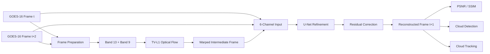
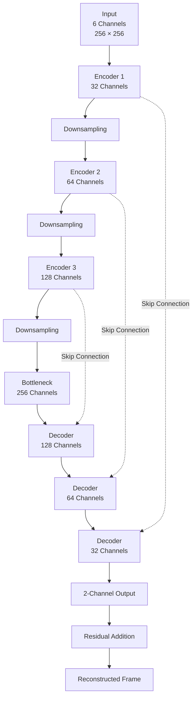
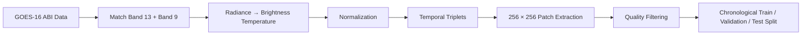
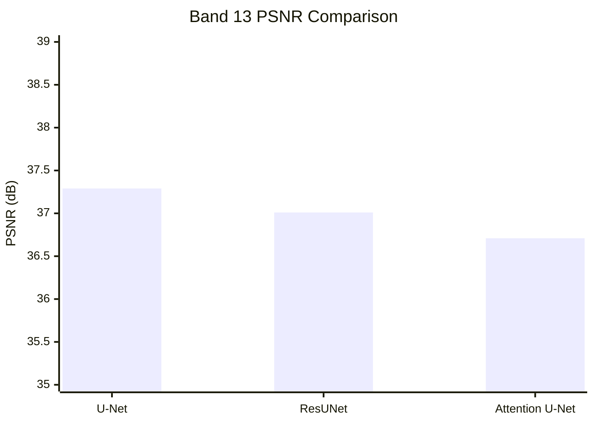
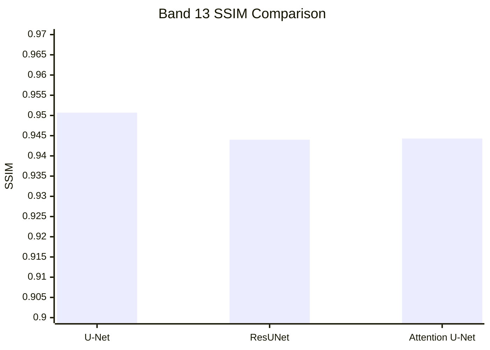
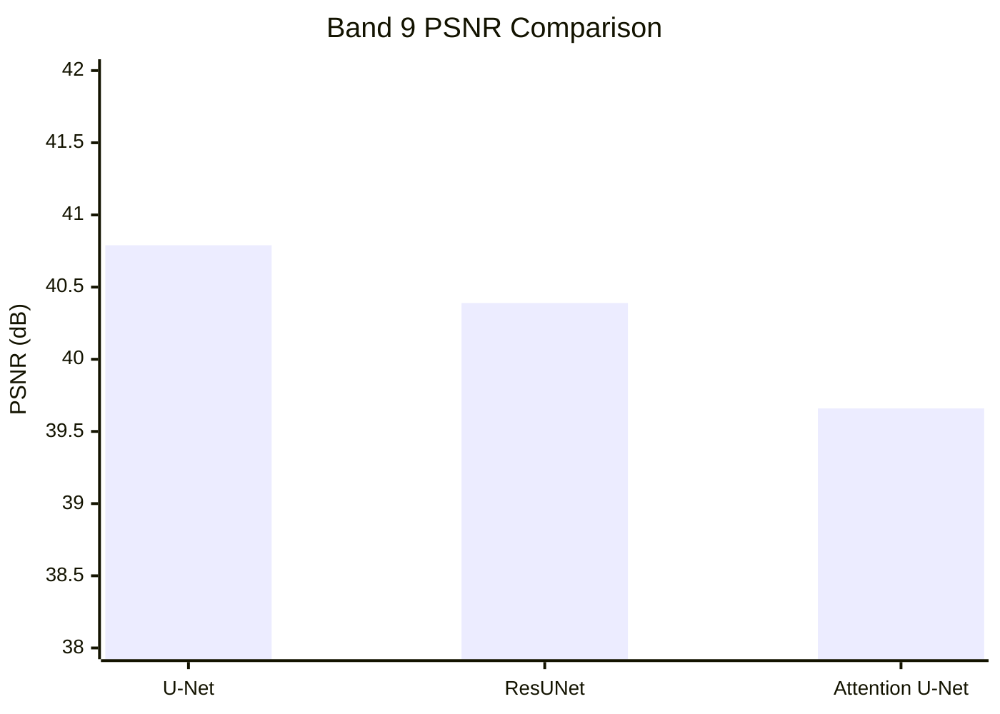
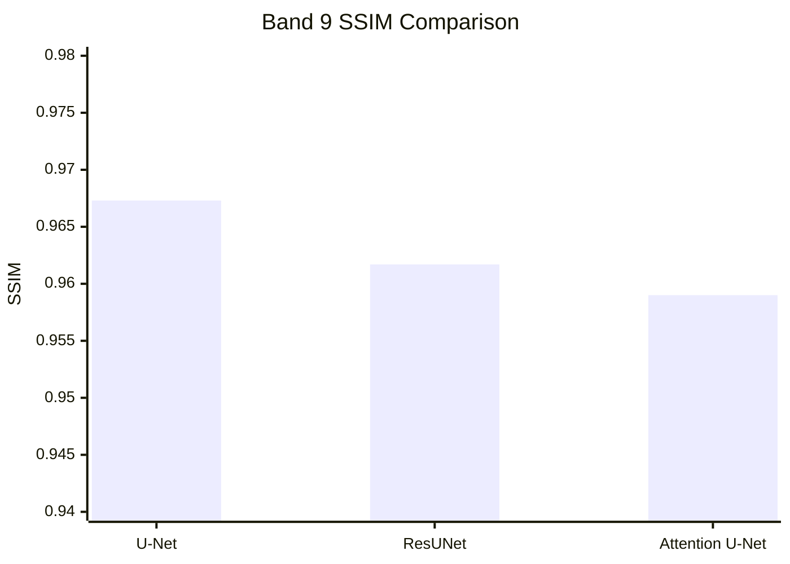
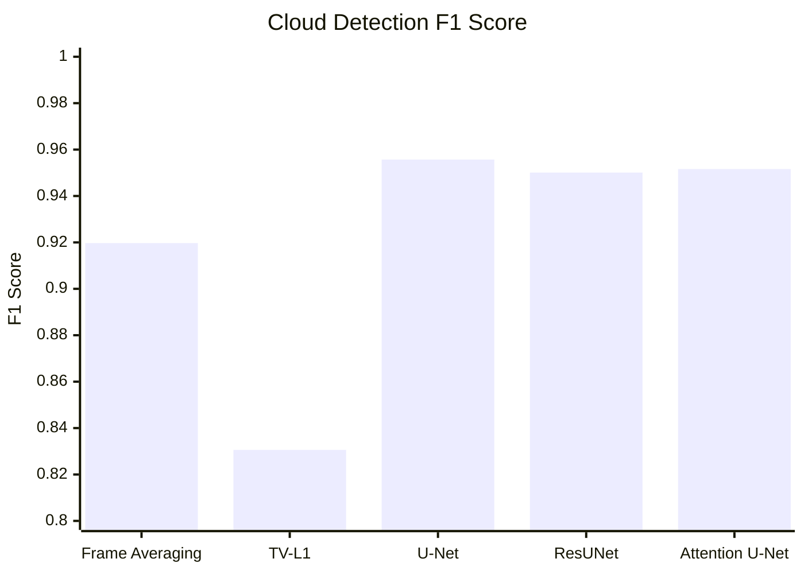
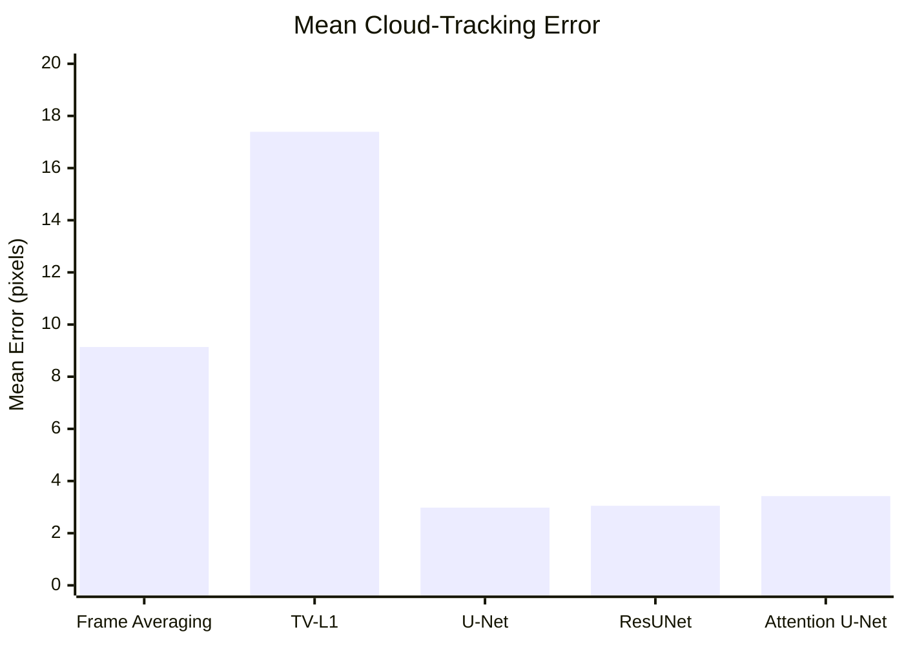
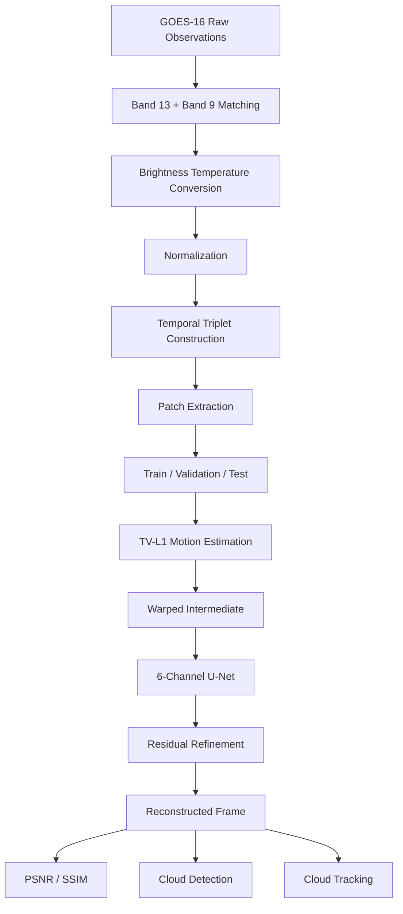

# Increasing Temporal Resolution of Geostationary Satellite

## Learning the Missing Moment Between Satellite Observations

<p align="center">
  <strong>GOES-16</strong> · <strong>Temporal Super-Resolution</strong> · <strong>Deep Learning</strong> · <strong>Remote Sensing</strong>
</p>

<p align="center">
  A deep learning framework for reconstructing intermediate satellite observations from surrounding GOES-16 imagery.
</p>

---

## Overview

Geostationary satellites provide continuous monitoring of atmospheric systems, but observations are still acquired at discrete time intervals. Rapidly evolving cloud structures can change significantly between two available observations.

This project investigates whether the **missing intermediate satellite observation** can be reconstructed from the observations immediately before and after it.

Given two observations at time \(t\) and \(t+2\), the system estimates the missing observation at \(t+1\):

```text
        Observed                         Observed
        Frame t                          Frame t+2
           │                                │
           │                                │
           └──────────────┬─────────────────┘
                          │
                          ▼
                  Missing Frame t+1
                    Reconstructed
```

The proposed approach combines:

* GOES-16 ABI Band 13 and Band 9 observations
* TV-L1 optical-flow-based motion estimation
* U-Net-based learned refinement
* Residual prediction
* Cloud detection evaluation
* Downstream cloud-motion tracking

The objective is not only to produce a visually plausible intermediate frame, but also to determine whether the reconstructed frame retains information useful for downstream atmospheric analysis.

---

# 1. Motivation

Satellite observations represent the atmosphere as a sequence of discrete snapshots:

```text
t₀ ───────────── t₁ ───────────── t₂
●                 ●                 ●
```

When an observation is unavailable:

```text
t₀ ─────────────────────────────── t₂
●                                 ●
                ?
                │
                ▼
          Missing t₁
```

A simple interpolation method may estimate the missing frame, but cloud structures can undergo complex motion and deformation between observations.

This motivates a learned temporal reconstruction approach that combines:

```text
Motion Estimation
       +
Learned Refinement
       ↓
Intermediate Satellite Reconstruction
```

---

# 2. Problem Statement

The project addresses the following problem:

> Given satellite observations before and after a missing time step, reconstruct the intermediate observation while preserving spatial structure and information relevant to downstream cloud analysis.

The reconstruction is evaluated at multiple levels:

```text
Reconstructed Frame
        │
        ├── Image Quality
        │      ├── MSE
        │      ├── PSNR
        │      └── SSIM
        │
        ├── Cloud Detection
        │      ├── Precision
        │      ├── Recall
        │      ├── F1
        │      └── Accuracy
        │
        └── Cloud Tracking
               ├── Mean Error
               ├── Median Error
               └── P90 Error
```

---

# 3. Proposed Approach

The system follows a two-stage reconstruction process.

### Stage 1 — Motion-Based Initialization

TV-L1 optical flow is used to estimate motion between the available satellite observations and generate an initial intermediate frame.

### Stage 2 — Learned Refinement

A compact U-Net receives the warped intermediate frame together with the two surrounding observations and learns a residual correction.

```text
GOES-16 Frame t
       │
       │
       ├─────────────────────┐
       │                     │
       ▼                     │
GOES-16 Frame t+2            │
       │                     │
       └──────────┬──────────┘
                  │
                  ▼
          TV-L1 Optical Flow
                  │
                  ▼
       Warped Intermediate Frame
                  │
                  ▼
          U-Net Refinement
                  │
                  ▼
          Learned Residual
                  │
                  ▼
       Reconstructed Frame t+1
```

The final prediction is formed as:

```text
Final Prediction
=
Warped Intermediate
+
Learned Residual
```

---

# 4. System Architecture



---

# 5. U-Net Architecture

The main model is a compact U-Net designed to refine the motion-based intermediate estimate.

Each satellite frame contains:

```text
Band 13
Band 9
```

The network receives three frames:

```text
Warped Intermediate
Frame t
Frame t+2
```

Therefore:

```text
3 frames × 2 channels = 6 input channels
```

The output contains:

```text
Band 13
Band 9
```

### Architecture



### Architecture Summary

| Component           | Configuration |
| ------------------- | ------------- |
| Input               | 6 channels    |
| Output              | 2 channels    |
| Input Resolution    | 256 × 256     |
| Encoder Channels    | 32 → 64 → 128 |
| Bottleneck          | 256           |
| Decoder Channels    | 128 → 64 → 32 |
| Skip Connections    | Yes           |
| Residual Refinement | Yes           |

---

# 6. Data Pipeline



The preprocessing pipeline:

1. Matches Band 13 and Band 9 observations.
2. Converts radiance values to brightness temperature.
3. Normalizes the channels.
4. Constructs consecutive temporal triplets.
5. Extracts 256 × 256 spatial patches.
6. Removes NaN-containing and near-uniform patches.
7. Creates chronological dataset partitions.

---

# 7. Dataset

The experiments use GOES-16 ABI Level-1b Radiance observations from **1 June 2024**.

| Property            | Configuration                  |
| ------------------- | ------------------------------ |
| Satellite           | GOES-16                        |
| Instrument          | Advanced Baseline Imager (ABI) |
| Product             | ABI Level-1b Radiance          |
| Date                | 2024-06-01                     |
| Bands               | Band 13 and Band 9             |
| Data Source         | NOAA AWS / goes2go             |
| Patch Size          | 256 × 256                      |
| Patch Stride        | 192                            |
| Total Triplets      | 21,766                         |
| Training Triplets   | 15,400                         |
| Validation Triplets | 3,159                          |
| Test Triplets       | 3,207                          |

### Temporal Triplet

Each sample consists of three consecutive observations:

```text
┌─────────────┐      ┌─────────────┐      ┌─────────────┐
│   Frame t   │      │ Frame t+1   │      │ Frame t+2   │
│             │      │             │      │             │
│    INPUT    │      │   TARGET    │      │    INPUT    │
└─────────────┘      └─────────────┘      └─────────────┘
```

The middle observation is used as the ground-truth target during training and evaluation.

---

# 8. Experimental Setup

| Parameter               |             Value |
| ----------------------- | ----------------: |
| Training Samples Used   |             8,000 |
| Validation Samples Used |             1,500 |
| Test Samples            |             3,207 |
| Batch Size              |                16 |
| Epochs                  |                14 |
| Optimizer               |              Adam |
| Learning Rate           |          1 × 10⁻⁴ |
| Loss Function           |           L1 Loss |
| Scheduler               | ReduceLROnPlateau |
| Scheduler Factor        |               0.5 |
| Scheduler Patience      |                 3 |
| Input Channels          |                 6 |
| Output Channels         |                 2 |

Training requires a CUDA-enabled GPU.

---

# 9. Models Compared

The project evaluates three learned architectures.

### U-Net

A compact encoder-decoder architecture with skip connections and residual refinement.

### ResUNet

A U-Net variant incorporating residual learning blocks.

### Attention U-Net

A U-Net variant incorporating attention mechanisms into feature fusion.

```text
                    Temporal Reconstruction
                             │
             ┌───────────────┼───────────────┐
             │               │               │
             ▼               ▼               ▼
           U-Net          ResUNet      Attention U-Net
```

---

# 10. Baselines

## Frame Averaging

The simplest interpolation baseline estimates the missing frame using:

```text
Prediction = (Frame t + Frame t+2) / 2
```

## TV-L1 Optical Flow

TV-L1 optical flow estimates motion between the available observations and uses the estimated motion to generate an intermediate frame.

The learned models use motion-based information as part of the reconstruction process and learn additional corrections.

---

# 11. Quantitative Results

## 11.1 Band 13 Reconstruction

| Model           |        PSNR (dB) |                SSIM |
| --------------- | ---------------: | ------------------: |
| U-Net           | **37.29 ± 2.92** | **0.9507 ± 0.0212** |
| ResUNet         |     37.01 ± 3.11 |     0.9440 ± 0.0254 |
| Attention U-Net |     36.71 ± 3.09 |     0.9443 ± 0.0248 |

### Band 13 PSNR



### Band 13 SSIM



---

# 12. Band 9 Reconstruction

| Model           |        PSNR (dB) |                SSIM |
| --------------- | ---------------: | ------------------: |
| U-Net           | **40.79 ± 3.31** | **0.9673 ± 0.0177** |
| ResUNet         |     40.39 ± 3.50 |     0.9617 ± 0.0201 |
| Attention U-Net |     39.66 ± 3.53 |     0.9590 ± 0.0215 |

### Band 9 PSNR



### Band 9 SSIM



---

# 13. Cloud Detection Evaluation

The reconstructed frames are evaluated for cloud detection performance.

| Method          |  Precision |     Recall |   F1 Score |   Accuracy |
| --------------- | ---------: | ---------: | ---------: | ---------: |
| Frame Averaging |     0.9426 |     0.8979 |     0.9197 |     0.9934 |
| TV-L1           |     0.8226 |     0.8387 |     0.8306 |     0.9856 |
| U-Net           | **0.9570** | **0.9544** | **0.9557** | **0.9963** |
| ResUNet         |     0.9396 |     0.9609 |     0.9501 |     0.9958 |
| Attention U-Net |     0.9526 |     0.9507 |     0.9516 |     0.9959 |

### Cloud Detection F1 Score



---

# 14. Downstream Cloud Tracking

Image reconstruction metrics alone do not determine whether the generated frame is useful for atmospheric analysis.

The reconstructed frames are therefore evaluated using downstream cloud-motion tracking.

| Method          | Mean Error (px) | Median Error (px) | P90 Error (px) |
| --------------- | --------------: | ----------------: | -------------: |
| Frame Averaging |            9.14 |              2.20 |          21.98 |
| TV-L1           |           17.39 |             11.10 |          45.15 |
| U-Net           |        **2.98** |          **0.67** |       **6.55** |
| ResUNet         |            3.05 |              0.88 |           6.89 |
| Attention U-Net |            3.42 |              0.80 |           7.39 |

Lower tracking error indicates smaller disagreement with the reference cloud-motion measurement.

### Mean Cloud-Tracking Error



---

# 15. Results at a Glance

| Metric                      | U-Net Result |
| --------------------------- | -----------: |
| Band 13 PSNR                | **37.29 dB** |
| Band 13 SSIM                |   **0.9507** |
| Band 9 PSNR                 | **40.79 dB** |
| Band 9 SSIM                 |   **0.9673** |
| Cloud Detection F1          |   **0.9557** |
| Cloud Detection Accuracy    |   **0.9963** |
| Mean Cloud Tracking Error   |  **2.98 px** |
| Median Cloud Tracking Error |  **0.67 px** |
| P90 Cloud Tracking Error    |  **6.55 px** |

---

# 16. Visual Results

## Reconstruction Example

The repository contains a generated visual comparison of the intermediate-frame reconstruction.


---

## Multi-Model Comparison

The project also includes a visual comparison across the evaluated reconstruction models.


---

# 17. End-to-End Workflow



---

# 18. Repository Structure

```text
Increasing_Temporal_Resolution_Of_Geostationary_Satellite/
│
├── data/
│   └── build_triplets.py
│
├── model/
│   └── unet_refine.py
│
├── eval/
│   └── evaluate_model.py
│
├── outputs/
│   └── figures/
│
├── train.py
├── train_resunet.py
├── train_attention_unet.py
├── demo.py
├── requirements.txt
└── README.md
```

---

# 19. Implementation

## Data Preparation

The temporal triplet construction pipeline is implemented in:

```text
data/build_triplets.py
```

The script performs:

* Band 13 / Band 9 temporal matching
* Radiance-to-brightness-temperature conversion
* Normalization
* Temporal triplet construction
* Patch extraction
* NaN filtering
* Near-uniform patch filtering
* Chronological dataset splitting

---

## Training

### U-Net

```bash
python train.py
```

### ResUNet

```bash
python train_resunet.py
```

### Attention U-Net

```bash
python train_attention_unet.py
```

---

## Evaluation

```bash
python eval/evaluate_model.py
```

The evaluation pipeline calculates reconstruction metrics and supports the downstream analysis used in the project.

---

## Demo

```bash
python demo.py
```

The demo generates visual comparisons between the available satellite observations, reconstructed intermediate frame, and reference frame.

---

# 20. Installation

Clone the repository:

```bash
git clone https://github.com/SrimathiSubbiah/Increasing_Temporal_Resolution_Of_Geostationary_Satellite.git
cd Increasing_Temporal_Resolution_Of_Geostationary_Satellite
```

Install dependencies:

```bash
pip install -r requirements.txt
```

### Main Dependencies

```text
Python
PyTorch
NumPy
Pandas
Matplotlib
OpenCV
Xarray
NetCDF4
scikit-image
torchvision
goes2go
```

---

# 21. Technology Stack

| Category          | Technology                        |
| ----------------- | --------------------------------- |
| Programming       | Python                            |
| Deep Learning     | PyTorch                           |
| Satellite Data    | GOES-16 ABI                       |
| Data Access       | NOAA AWS / goes2go                |
| Image Processing  | OpenCV / scikit-image             |
| Data Processing   | NumPy / Pandas / Xarray           |
| Motion Estimation | TV-L1 Optical Flow                |
| Visualization     | Matplotlib                        |
| Models            | U-Net / ResUNet / Attention U-Net |

---

# 22. What Makes the Project Different?

The project evaluates temporal reconstruction beyond pixel-level similarity.

Instead of stopping at:

```text
Input → Model → Image
```

the evaluation continues:

```text
Input Observations
        ↓
Temporal Reconstruction
        ↓
Image Quality
        ↓
Cloud Detection
        ↓
Cloud Motion Tracking
```

This provides multiple perspectives on whether the reconstructed frame retains useful atmospheric information.

---

# 23. Key Findings

The reported experiments show that:

* The U-Net achieves **37.29 dB PSNR** and **0.9507 SSIM** on Band 13.
* The U-Net achieves **40.79 dB PSNR** and **0.9673 SSIM** on Band 9.
* The U-Net achieves a reported **cloud detection F1 score of 0.9557**.
* The U-Net achieves a reported **mean cloud-tracking error of 2.98 pixels**.
* Learned reconstruction provides a motion-aware alternative to simple frame averaging.
* The reconstructed frames retain information relevant to the evaluated cloud-detection and cloud-tracking tasks.

These findings apply to the evaluated GOES-16 dataset and experimental configuration.

---

# 24. Limitations

The current study has several limitations:

* The experiments use observations from a single day.
* The dataset is based on GOES-16 observations.
* Only Band 13 and Band 9 are used.
* The model operates on 256 × 256 patches.
* The main training configuration uses a subset of the available training triplets.
* Broader validation across different weather systems, seasons, and geographic conditions is required.

---

# 25. Future Work

Potential extensions include:

```text
Multi-Day Dataset
       ↓
Multi-Season Training
       ↓
Additional Spectral Bands
       ↓
Cross-Satellite Evaluation
       ↓
Transformer-Based Temporal Models
       ↓
Uncertainty-Aware Reconstruction
       ↓
Real-Time Deployment
```

Additional directions include evaluating rapidly evolving severe-weather systems and improving physical-consistency constraints.

---

# 26. Research Contribution

This project explores temporal super-resolution of geostationary satellite observations using a combination of motion estimation and deep learning.

The overall framework connects:

```text
Satellite Observation
        ↓
Motion Estimation
        ↓
Learned Refinement
        ↓
Intermediate Reconstruction
        ↓
Image Evaluation
        ↓
Atmospheric Feature Evaluation
```

The central idea is to use the information contained in surrounding satellite observations to estimate an atmospheric state that was not directly observed.

---

# 27. Project Highlights

| Component              | Implementation                    |
| ---------------------- | --------------------------------- |
| Satellite              | GOES-16                           |
| Instrument             | ABI                               |
| Spectral Bands         | 13 and 9                          |
| Task                   | Intermediate Frame Reconstruction |
| Main Model             | Residual U-Net                    |
| Input                  | 6 channels                        |
| Output                 | 2 channels                        |
| Patch Size             | 256 × 256                         |
| Total Triplets         | 21,766                            |
| Test Samples           | 3,207                             |
| Reconstruction Metrics | MSE, PSNR, SSIM                   |
| Downstream Task        | Cloud Detection                   |
| Motion Evaluation      | Cloud Tracking                    |
| Motion Initialization  | TV-L1 Optical Flow                |

---

# 28. Reproducibility

The complete workflow can be summarized as:

```text
Acquire GOES-16 Data
        ↓
Build Temporal Triplets
        ↓
Extract and Filter Patches
        ↓
Train Reconstruction Model
        ↓
Generate Intermediate Frames
        ↓
Evaluate PSNR / SSIM
        ↓
Evaluate Cloud Detection
        ↓
Evaluate Cloud Tracking
        ↓
Generate Visual Comparisons
```

The repository separates the data preparation, model, training, evaluation, and demonstration components so that each stage can be inspected independently.

---

# 29. Conclusion

This project investigates whether deep learning can increase the effective temporal resolution of geostationary satellite imagery by reconstructing an intermediate observation between two known frames.

The proposed framework combines:

```text
GOES-16 Observations
        +
TV-L1 Motion Estimation
        +
Residual U-Net Refinement
        ↓
Intermediate Satellite Reconstruction
```

The reconstructed frames are evaluated through image reconstruction metrics as well as downstream cloud detection and cloud-motion tracking.

The results demonstrate the potential of learned temporal reconstruction for estimating missing intermediate observations on the evaluated GOES-16 dataset.

---

# Authors

**Srimathi Subbiah**
**Zohra Fakrudeen Ali**

Machine Learning Project
**Increasing Temporal Resolution of Geostationary Satellite**


> **Instead of waiting for the next satellite observation, learn what happened between the observations.**


